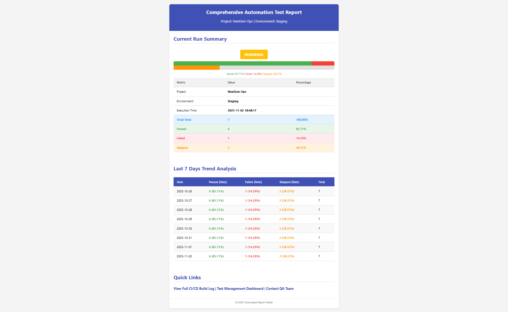
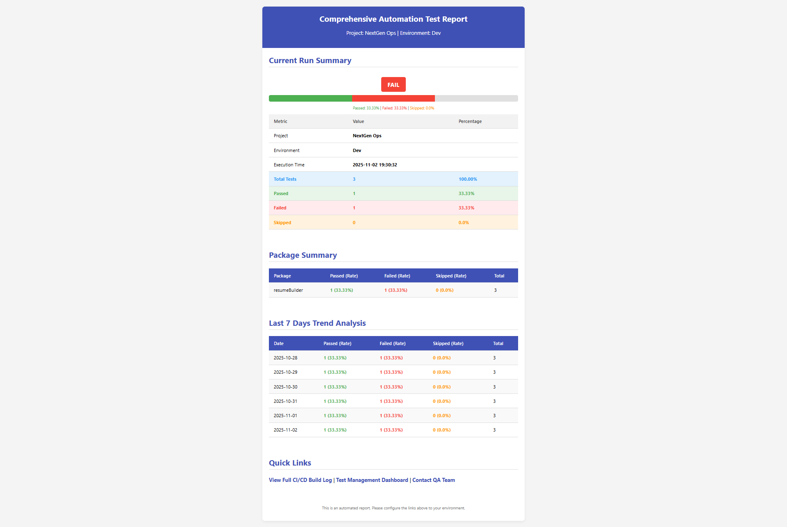
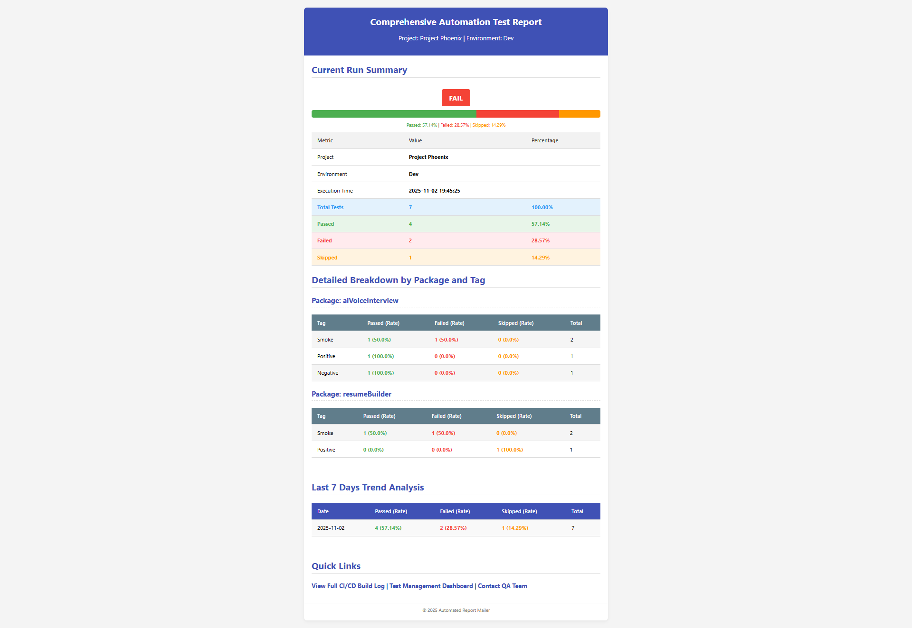

# Python Automation Test Report Generator - Complete Documentation

*A comprehensive Python-based automation test reporting system with environment, package, and tag-wise reporting capabilities*

---

## 📑 Table of Contents

- [📊 Project Overview](#-project-overview)
- [🚀 Evolution of Features](#-evolution-of-features)
- [🏗️ Project Structure](#️-project-structure)
- [✨ Core Features](#-core-features)
- [🔧 Setup & Installation](#-setup--installation)
- [📊 Report Levels](#-report-levels)
  - [📄 Basic Report (Version 1.0)](#-basic-report-version-10)
  - [🌍 Environment-Wise Report (Version 2.0)](#-environment-wise-report-version-20)
  - [📦 Package-Wise Report (Version 3.0)](#-package-wise-report-version-30)
  - [🏷️ Tag-Wise Report (Version 4.0)](#️-tag-wise-report-version-40)
- [🚀 Usage Examples](#-usage-examples)
- [⚙️ Configuration](#️-configuration)
- [📧 Email Reports](#-email-reports)
- [🔍 Troubleshooting](#-troubleshooting)
- [📈 Future Enhancements](#-future-enhancements)
- [🤝 Contributing](#-contributing)
- [📄 License](#-license)

---

## 📊 Project Overview

**Project Name:** Project Phoenix  
**Environments:** Dev, Staging, Production  
**Report Types:** Basic, Environment-Wise, Package-Wise, Tag-Wise Automation Test Reports

This comprehensive system provides automated test reporting with progressive enhancement from basic reporting to advanced multi-dimensional analytics:

- **Automated test result collection** via pytest hooks
- **Beautiful HTML report generation** with trend analysis
- **Email delivery** with Gmail SMTP integration
- **7-day historical trend tracking**
- **Environment-specific reporting** (dev, staging, prod)
- **Package-level organization** and analytics
- **Tag-based categorization** (smoke, positive, negative)
- **Multi-dimensional analytics** combining environment, package, and tag data

## 🚀 Evolution of Features

| Version | Features | Key Enhancements |
|---------|----------|------------------|
| **1.0** | Basic Reporting | Test collection, HTML reports, email integration, trend analysis |
| **2.0** | Environment-Wise | Multi-environment support, environment-specific data storage |
| **3.0** | Package-Wise | Package-level organization, cross-package analytics |
| **4.0** | Tag-Wise | Tag categorization, multi-dimensional analytics, tag filtering |

## 🏗️ Project Structure

```
Python_Report/
├── testcases/                  # Main test directory
│   ├── aiVoiceInterview/      # AI Voice Interview package
│   │   ├── __init__.py        # Package initialization
│   │   └── test_interview_questions.py  # Tagged interview test cases
│   └── resumeBulder/          # Resume Builder package
│   │   ├── __init__.py        # Package initialization
│   │   ├── test_resume_creation.py      # Tagged resume creation tests
│   │   └── 
│   ├── test_sample.py     # Sample test cases
│
├── conftest.py               # Pytest configuration with all enhancements
├── generate_report.py        # Report generation engine
├── pytest.ini              # Pytest configuration file
├── report_data.json         # Test results data storage
├── report_output.html       # Generated HTML reports
├── README.md               # This comprehensive documentation

```

## ✨ Core Features

### 🎯 Multi-Dimensional Reporting
- **Environment Awareness**: Run tests against dev, staging, or production
- **Package Organization**: Structured test organization by functional areas
- **Tag Categorization**: Test categorization using pytest markers
- **Cross-Dimensional Analytics**: Compare performance across environments, packages, and tags

### 📈 Advanced Analytics
- **Real-time Metrics**: Current test execution results
- **Historical Trends**: 7-day performance tracking
- **Success Rate Calculations**: Percentage-based metrics
- **Progress Visualization**: Color-coded progress bars and status indicators

### 🎨 Professional Presentation
- **Responsive HTML Reports**: Optimized for all devices
- **Email Integration**: Automated report delivery
- **Visual Status Indicators**: Color-coded pass/fail/skip rates
- **Professional Styling**: Modern CSS with consistent branding

## 🔧 Setup & Installation

### Prerequisites
- Python 3.7+
- pytest
- Gmail account with App Password enabled

### Installation Steps

1. **Clone or download the project files**
2. **Install required dependencies:**
   ```bash
   pip install pytest
   ```

3. **Configure email settings in `generate_report.py`:**
   ```python
   SENDER_EMAIL = "your-email@gmail.com"
   SENDER_PASSWORD = "your-app-password"  # Gmail App Password
   RECEIVER_EMAIL = "recipient@gmail.com"
   ```

4. **Create test package structure:**
   ```bash
   mkdir testcases
   mkdir testcases/aiVoiceInterview
   mkdir testcases/resumeBuilder
   touch testcases/aiVoiceInterview/__init__.py
   touch testcases/resumeBuilder/__init__.py
   # Add your test files in respective package directories
   ```

---

## 📊 Report Levels

## 📄 Basic Report (Version 1.0)

*Foundation-level test reporting with core functionality*

### 🎯 Features
- Automated test result collection via pytest hooks
- Basic HTML report generation
- Email delivery with Gmail SMTP
- 7-day historical trend tracking
- Simple success rate calculations

### 🔧 Usage
```bash
pytest testcases\test_sample.py -v
```

### 📊 Sample Test Structure
```python
import pytest

def test_login_page_loads_successfully():
    assert True

def test_user_can_login_with_valid_credentials():
    assert 1 == 1

def test_user_cannot_login_with_invalid_password():
    assert False, "Login failed with invalid password"

@pytest.mark.skip(reason="Payment gateway integration is pending.")
def test_checkout_process_completes_successfully():
    assert True
```

### 📧 Basic Email Report Preview


    

### 📝 Source Code - Basic Version

#### conftest.py (Basic)
```python
import pytest
import json
import os
from datetime import datetime, timedelta
from generate_report import load_report_data, generate_html_report, send_email, calculate_percentage

# --- Configuration ---
REPORT_FILE = "report_data.json"
DAYS_TO_KEEP = 7
REPORT_TITLE = "Comprehensive Automation Test Report"
PROJECT_NAME = "Project Phoenix"
ENVIRONMENT = "Staging"

def load_report_data():
    """Loads existing report data from the JSON file."""
    if not os.path.exists(REPORT_FILE):
        return {
            "report_title": REPORT_TITLE,
            "project_name": PROJECT_NAME,
            "environment": ENVIRONMENT,
            "current_run": {},
            "trend_data": []
        }
    try:
        with open(REPORT_FILE, 'r') as f:
            return json.load(f)
    except (json.JSONDecodeError, FileNotFoundError):
        print(f"Warning: Could not load or decode existing report data from {REPORT_FILE}. Starting with fresh data structure.")
        return load_report_data()

def save_report_data(data):
    """Saves the updated report data to the JSON file."""
    with open(REPORT_FILE, 'w') as f:
        json.dump(data, f, indent=4)

def delete_old_data(trend_data):
    """Removes trend data older than DAYS_TO_KEEP."""
    cutoff_date = (datetime.now() - timedelta(days=DAYS_TO_KEEP)).date()
    new_trend_data = [
        record for record in trend_data
        if datetime.strptime(record["date"], "%Y-%m-%d").date() >= cutoff_date
    ]
    return new_trend_data

def update_trend_data(trend_data, new_data):
    """Updates the trend data."""
    current_date_str = new_data["date"]
    trend_data = [record for record in trend_data if record["date"] != current_date_str]
    trend_data.append(new_data)
    return trend_data

@pytest.hookimpl(tryfirst=True, hookwrapper=True)
def pytest_runtestloop(session):
    """Hook to initialize and finalize the reporting process."""
    session.results = {"passed": 0, "failed": 0, "skipped": 0, "total": 0}
    yield
    
    # Finalization after all tests
    report_data = load_report_data()
    current_time_str = datetime.now().strftime("%Y-%m-%d %H:%M:%S")
    current_date_str = datetime.now().strftime("%Y-%m-%d")

    current_run_data = {
        "timestamp": current_time_str,
        "total": session.results["total"],
        "passed": session.results["passed"],
        "failed": session.results["failed"],
        "skipped": session.results["skipped"]
    }

    report_data["current_run"] = current_run_data
    new_trend_entry = {
        "date": current_date_str,
        "total": session.results["total"],
        "passed": session.results["passed"],
        "failed": session.results["failed"],
        "skipped": session.results["skipped"]
    }

    report_data["trend_data"] = update_trend_data(report_data["trend_data"], new_trend_entry)
    report_data["trend_data"] = delete_old_data(report_data["trend_data"])
    save_report_data(report_data)
    print(f"\n[Pytest Report Generator] Successfully updated report data in {REPORT_FILE}")

    # Generate and send email report
    try:
        final_report_data = load_report_data()
        html_report = generate_html_report(final_report_data)
        success_rate = calculate_percentage(final_report_data["current_run"]["passed"], final_report_data["current_run"]["total"])
        subject = f'Automation Report: {final_report_data["project_name"]} - {success_rate}% Success'
        send_email(html_report, subject)
        
        with open("report_output.html", "w") as f:
            f.write(html_report)
        print(f"[Pytest Report Generator] HTML report saved to report_output.html.")
        
    except Exception as e:
        print(f"[Pytest Report Generator] Error during email generation: {e}")

@pytest.hookimpl(hookwrapper=True)
def pytest_runtest_makereport(item, call):
    """Hook to capture test results (passed, failed, skipped)."""
    outcome = yield
    report = outcome.get_result()

    if report.when == "call":
        item.session.results["total"] += 1
        if report.passed:
            item.session.results["passed"] += 1
        elif report.failed:
            item.session.results["failed"] += 1
    elif report.when == "setup" and report.skipped:
        item.session.results["skipped"] += 1
```

#### generate_report.py (Basic)
```python
import json
from datetime import datetime
from email.mime.multipart import MIMEMultipart
from email.mime.text import MIMEText
import smtplib

# --- Configuration ---
SENDER_EMAIL = "your-email@gmail.com"
SENDER_PASSWORD = "your-app-password"
RECEIVER_EMAIL = "recipient@gmail.com"

def load_report_data(file_path="report_data.json"):
    """Loads report data from an external JSON file."""
    try:
        with open(file_path, 'r') as f:
            data = json.load(f)
            if "timestamp" in data:
                try:
                    dt_object = datetime.strptime(data["timestamp"], "%Y-%m-%d %H:%M:%S")
                    data["timestamp"] = dt_object.strftime("%Y-%m-%d %H:%M:%S")
                except ValueError:
                    pass
            return data
    except FileNotFoundError:
        print(f"[ERROR] JSON file not found at {file_path}. Please create it.")
        return None
    except json.JSONDecodeError:
        print(f"[ERROR] Could not decode JSON from {file_path}. Check file format.")
        return None

def calculate_percentage(part, total):
    """Calculates percentage and handles division by zero."""
    return round((part / total) * 100, 2) if total > 0 else 0.00

def generate_html_report(report_data):
    """Generates the full HTML content for the email report."""
    current_run = report_data["current_run"]
    total = current_run["total"]
    
    success_rate = calculate_percentage(current_run["passed"], total)
    overall_status = "PASS" if success_rate >= 90 else ("WARNING" if success_rate >= 70 else "FAIL")
    status_color = "#4CAF50" if overall_status == "PASS" else ("#FFC107" if overall_status == "WARNING" else "#F44336")

    # HTML styling and content generation
    style = f"""
    <style>
        body {{ font-family: 'Segoe UI', Tahoma, Geneva, Verdana, sans-serif; background-color: #f4f4f4; margin: 0; padding: 20px; }}
        .container {{ max-width: 800px; margin: 0 auto; background-color: #ffffff; border-radius: 8px; box-shadow: 0 4px 8px rgba(0,0,0,0.05); overflow: hidden; }}
        .header {{ background-color: #3f51b5; color: white; padding: 20px; text-align: center; }}
        .header h1 {{ margin: 0; font-size: 24px; }}
        .section {{ padding: 20px; }}
        h2 {{ color: #3f51b5; border-bottom: 2px solid #e0e0e0; padding-bottom: 5px; margin-top: 0; }}
        table {{ width: 100%; border-collapse: collapse; margin-bottom: 20px; }}
        th, td {{ padding: 12px 15px; text-align: left; border-bottom: 1px solid #ddd; font-size: 14px; }}
        th {{ background-color: #f2f2f2; color: #333; font-weight: 600; }}
        .status-pass {{ background-color: #E8F5E9; color: #4CAF50; font-weight: bold; }}
        .status-fail {{ background-color: #FFEBEE; color: #F44336; font-weight: bold; }}
        .status-skip {{ background-color: #FFF3E0; color: #FF9800; font-weight: bold; }}
        .overall-status {{ display: inline-block; padding: 10px 20px; border-radius: 5px; color: white; font-size: 18px; font-weight: bold; margin-top: 10px; background-color: {status_color}; }}
        .progress-bar-container {{ width: 100%; background-color: #e0e0e0; border-radius: 5px; margin: 10px 0; overflow: hidden; }}
        .progress-bar-pass {{ height: 20px; background-color: #4CAF50; float: left; }}
        .progress-bar-fail {{ height: 20px; background-color: #F44336; float: left; }}
        .progress-bar-skip {{ height: 20px; background-color: #FF9800; float: left; }}
    </style>
    """

    summary_html = f"""
    <h2>Current Run Summary</h2>
    <div style="text-align: center;">
        <div class="overall-status">{overall_status} ({success_rate}%)</div>
        <div class="progress-bar-container">
            <div class="progress-bar-pass" style="width: {calculate_percentage(current_run["passed"], total)}%;"></div>
            <div class="progress-bar-fail" style="width: {calculate_percentage(current_run["failed"], total)}%;"></div>
            <div class="progress-bar-skip" style="width: {calculate_percentage(current_run["skipped"], total)}%;"></div>
        </div>
        <p style="font-size: 12px; color: #777;">
            <span style="color: #4CAF50;">Passed: {calculate_percentage(current_run["passed"], total)}%</span> | 
            <span style="color: #F44336;">Failed: {calculate_percentage(current_run["failed"], total)}%</span> | 
            <span style="color: #FF9800;">Skipped: {calculate_percentage(current_run["skipped"], total)}%</span>
        </p>
    </div>
    <table>
        <tr><th>Metric</th><th>Value</th><th>Percentage</th></tr>
        <tr><td>Project</td><td>{report_data["project_name"]}</td><td></td></tr>
        <tr><td>Environment</td><td>{report_data["environment"]}</td><td></td></tr>
        <tr><td>Execution Time</td><td>{current_run["timestamp"]}</td><td></td></tr>
        <tr class="status-pass"><td>Total Tests</td><td>{total}</td><td>100.00%</td></tr>
        <tr class="status-pass"><td>Passed</td><td>{current_run["passed"]}</td><td>{calculate_percentage(current_run["passed"], total)}%</td></tr>
        <tr class="status-fail"><td>Failed</td><td>{current_run["failed"]}</td><td>{calculate_percentage(current_run["failed"], total)}%</td></tr>
        <tr class="status-skip"><td>Skipped</td><td>{current_run["skipped"]}</td><td>{calculate_percentage(current_run["skipped"], total)}%</td></tr>
    </table>
    """

    html_content = f"""
    <!DOCTYPE html>
    <html>
    <head>
        <meta charset="utf-8">
        <title>{report_data["report_title"]}</title>
        {style}
    </head>
    <body>
        <div class="container">
            <div class="header">
                <h1>{report_data["report_title"]}</h1>
                <p>Project: {report_data["project_name"]} | Environment: {report_data["environment"]}</p>
            </div>
            <div class="section">
                {summary_html}
            </div>
        </div>
    </body>
    </html>
    """
    return html_content

def send_email(html_content, subject):
    """Sends the HTML email using Gmail's SMTP server."""
    msg = MIMEMultipart('alternative')
    msg['Subject'] = subject
    msg['From'] = SENDER_EMAIL
    msg['To'] = RECEIVER_EMAIL
    msg.attach(MIMEText(html_content, 'html'))

    try:
        server = smtplib.SMTP('smtp.gmail.com', 587)
        server.starttls()
        server.login(SENDER_EMAIL, SENDER_PASSWORD)
        server.sendmail(SENDER_EMAIL, RECEIVER_EMAIL, msg.as_string())
        server.quit()
        print("\n[SUCCESS] Email report sent successfully!")
    except Exception as e:
        print(f"\n[ERROR] Failed to send email: {e}")
```
### report_data.json - Test Results Data Storage

```json
{
    "report_title": "Comprehensive Automation Test Report",
    "project_name": "NextGen Ops",
    "environment": "Staging",
    "current_run": {
        "timestamp": "2025-11-02 18:48:17",
        "total": 7,
        "passed": 6,
        "failed": 1,
        "skipped": 2
    },
    "trend_data": [
        {
            "date": "2025-10-26",
            "total": 7,
            "passed": 6,
            "failed": 1,
            "skipped": 2
        },
        {
            "date": "2025-10-27",
            "total": 7,
            "passed": 6,
            "failed": 1,
            "skipped": 2
        },
        {
            "date": "2025-10-28",
            "total": 7,
            "passed": 6,
            "failed": 1,
            "skipped": 2
        },
        {
            "date": "2025-10-29",
            "total": 7,
            "passed": 6,
            "failed": 1,
            "skipped": 2
        },
        {
            "date": "2025-10-30",
            "total": 7,
            "passed": 6,
            "failed": 1,
            "skipped": 2
        },
        {
            "date": "2025-10-31",
            "total": 7,
            "passed": 6,
            "failed": 1,
            "skipped": 2
        },
        {
            "date": "2025-11-01",
            "total": 7,
            "passed": 6,
            "failed": 1,
            "skipped": 2
        },
        {
            "date": "2025-11-02",
            "total": 7,
            "passed": 6,
            "failed": 1,
            "skipped": 2
        }
    ]
}
```


## 🌍 Environment-Wise Report (Version 2.0)

*Enhanced reporting with multi-environment support*

### 🎯 Features
- Multi-environment support (dev, staging, prod)
- Environment-specific test execution
- Separate data storage per environment
- Environment-aware email subjects
- Cross-environment comparison capability


### 📊 Environment-Specific Test Organization
```bash
# Run tests for specific environments
pytest testcases/ --env dev -v
pytest testcases/ --env staging -v
pytest testcases/ --env prod -v
```

### 📧 Environment-Wise Email Report Preview


### 📝 Source Code - Environment-Wise Enhancements

#### conftest.py (Environment-Wise)
```python
import pytest
import json
import os
from datetime import datetime, timedelta
from generate_report import load_report_data, generate_html_report, send_email, calculate_percentage

# --- Configuration ---
REPORT_FILE = "report_data.json"
DAYS_TO_KEEP = 7
REPORT_TITLE = "Comprehensive Automation Test Report"
PROJECT_NAME = "NextGen Ops"
DEFAULT_ENVIRONMENT = "staging"  # Default environment if not specified


# --- Utility Functions ---

def load_report_data():
    """Loads existing report data from the JSON file."""
    if not os.path.exists(REPORT_FILE):
        return {
            "report_title": REPORT_TITLE,
            "project_name": PROJECT_NAME,
            "environments": {
                "dev": {"trend_data": []},
                "staging": {"trend_data": []},
                "prod": {"trend_data": []}
            }
        }
    try:
        with open(REPORT_FILE, 'r') as f:
            data = json.load(f)
            # Ensure the environment keys exist in the loaded data
            if "environments" not in data:
                data["environments"] = {
                    "dev": {"trend_data": []},
                    "staging": {"trend_data": []},
                    "prod": {"trend_data": []}
                }
            for env in ["dev", "staging", "prod"]:
                if env not in data["environments"]:
                    data["environments"][env] = {"trend_data": []}
            return data
    except (json.JSONDecodeError, FileNotFoundError):
        print(
            f"Warning: Could not load or decode existing report data from {REPORT_FILE}. Starting with fresh data structure.")
        return load_report_data()  # Return the default structure


def save_report_data(data):
    """Saves the updated report data to the JSON file."""
    with open(REPORT_FILE, 'w') as f:
        json.dump(data, f, indent=4)


def delete_old_data(trend_data):
    """Removes trend data older than DAYS_TO_KEEP."""
    cutoff_date = (datetime.now() - timedelta(days=DAYS_TO_KEEP)).date()

    # Filter out records older than the cutoff date
    new_trend_data = [
        record for record in trend_data
        if datetime.strptime(record["date"], "%Y-%m-%d").date() >= cutoff_date
    ]
    return new_trend_data


def update_trend_data(trend_data, new_data):
    """
    Updates the trend data:
    1. Removes any existing entry for the current day.
    2. Appends the new data.
    """
    current_date_str = new_data["date"]

    # Remove existing entry for today
    trend_data = [
        record for record in trend_data
        if record["date"] != current_date_str
    ]

    # Append the new data
    trend_data.append(new_data)

    return trend_data


# --- Pytest Hooks ---

def pytest_addoption(parser):
    """Adds command line option to specify the environment."""
    parser.addoption(
        "--env",
        action="store",
        default=DEFAULT_ENVIRONMENT,
        choices=["dev", "staging", "prod"],
        help="Environment to run tests against: dev, staging, or prod"
    )


@pytest.fixture(scope="session")
def env(request):
    """Fixture to provide the environment to tests and hooks."""
    return request.config.getoption("--env")


@pytest.hookimpl(tryfirst=True, hookwrapper=True)
def pytest_runtestloop(session):
    """
    Hook to initialize and finalize the reporting process.
    """
    # Get the environment from the fixture
    environment = session.config.getoption("--env")

    # Initialize session data storage
    session.results = {
        "passed": 0,
        "failed": 0,
        "skipped": 0,
        "total": 0,
        "package_summary": {}
    }

    # Execute all tests
    yield

    # --- Finalization (After all tests are done) ---

    # 1. Load existing data
    report_data = load_report_data()

    # 2. Get the environment-specific trend data
    env_data = report_data["environments"].get(environment, {"trend_data": []})
    trend_data = env_data["trend_data"]

    # 3. Prepare new trend entry
    current_time_str = datetime.now().strftime("%Y-%m-%d %H:%M:%S")
    current_date_str = datetime.now().strftime("%Y-%m-%d")

    new_trend_entry = {
        "date": current_date_str,
        "timestamp": current_time_str,
        "total": session.results["total"],
        "passed": session.results["passed"],
        "failed": session.results["failed"],
        "skipped": session.results["skipped"],
        "package_summary": session.results["package_summary"]  # Include package summary
    }

    # 4. Update and prune trend data
    trend_data = update_trend_data(trend_data, new_trend_entry)
    trend_data = delete_old_data(trend_data)

    # 5. Update the main report structure with the new trend data
    report_data["environments"][environment]["trend_data"] = trend_data

    # 6. Save the final data
    save_report_data(report_data)
    print(
        f"\n[Pytest Report Generator] Successfully updated report data for environment '{environment}' in {REPORT_FILE}")

    # 7. Generate and Send Email Report
    try:
        # Extract the current run data from the last entry in the trend data
        if not trend_data:
            print(
                f"[Pytest Report Generator] No test data found for environment '{environment}'. Skipping email generation.")
            return

        current_run_data = trend_data[-1]

        # Create a temporary structure for generate_report.py
        final_report_data = {
            "report_title": report_data["report_title"],
            "project_name": report_data["project_name"],
            "environment": environment.capitalize(),
            "current_run": current_run_data,
            "trend_data": trend_data
        }

        # Generate HTML
        html_report = generate_html_report(final_report_data)

        # Define Subject
        success_rate = calculate_percentage(current_run_data["passed"], current_run_data["total"])
        subject = f'Automation Report: {final_report_data["project_name"]} - {final_report_data["environment"]} - {success_rate}% Success'

        # Send Email
        # NOTE: The send_email function is commented out. Uncomment to send.
        #send_email(html_report, subject)

        # Save HTML for inspection
        with open(f"report_output_{environment}.html", "w") as f:
            f.write(html_report)

        print(f"[Pytest Report Generator] HTML report saved to report_output_{environment}.html.")
        print(f"[Pytest Report Generator] Email generation complete. Uncomment 'send_email' in conftest.py to send.")

    except Exception as e:
        print(f"[Pytest Report Generator] Error during email generation for {environment}: {e}")


@pytest.hookimpl(hookwrapper=True)
def pytest_runtest_makereport(item, call):
    """
    Hook to capture test results (passed, failed, skipped).
    """
    outcome = yield
    report = outcome.get_result()

    # Only process once per test item to avoid double counting
    if report.when != "call" and not (report.when == "setup" and report.skipped):
        return

    # Determine the package name
    try:
        test_file_path = str(item.fspath)
        path_parts = test_file_path.split(os.sep)
        for i, part in enumerate(path_parts):
            if part.endswith('.py'):
                if i > 0:
                    package_name = path_parts[i-1]
                else:
                    package_name = "Other"
                break
        else:
            package_name = "Other"
    except Exception:
        package_name = "Other"

    # Initialize package summary if it doesn't exist
    if package_name not in item.session.results["package_summary"]:
        item.session.results["package_summary"][package_name] = {
            "passed": 0,
            "failed": 0,
            "skipped": 0,
            "total": 0
        }

    package_summary = item.session.results["package_summary"][package_name]

    if report.when == "call":
        item.session.results["total"] += 1
        package_summary["total"] += 1

        if report.passed:
            item.session.results["passed"] += 1
            package_summary["passed"] += 1
        elif report.failed:
            item.session.results["failed"] += 1
            package_summary["failed"] += 1

    elif report.when == "setup" and report.skipped:
        item.session.results["skipped"] += 1
        item.session.results["total"] += 1
        package_summary["skipped"] += 1
        package_summary["total"] += 1
```

#### generate_report.py (Environment-Wise)
```python
import json
from datetime import datetime
from email.mime.multipart import MIMEMultipart
from email.mime.text import MIMEText
import smtplib

# --- Configuration ---
SENDER_EMAIL = "your-email@gmail.com"
SENDER_PASSWORD = "your-app-password"
RECEIVER_EMAIL = "recipient@gmail.com"

def load_report_data(file_path="report_data.json"):
    """Loads report data from an external JSON file."""
    try:
        with open(file_path, 'r') as f:
            data = json.load(f)
            return data
    except FileNotFoundError:
        print(f"[ERROR] JSON file not found at {file_path}. Please create it.")
        return None
    except json.JSONDecodeError:
        print(f"[ERROR] Could not decode JSON from {file_path}. Check file format.")
        return None

def calculate_percentage(part, total):
    """Calculates percentage and handles division by zero."""
    return round((part / total) * 100, 2) if total > 0 else 0.00

def generate_html_report(report_data):
    """Generates the full HTML content for the email report."""
    current_run = report_data["current_run"]
    total = current_run["total"]
    
    success_rate = calculate_percentage(current_run["passed"], total)
    overall_status = "PASS" if success_rate >= 90 else ("WARNING" if success_rate >= 70 else "FAIL")
    status_color = "#4CAF50" if overall_status == "PASS" else ("#FFC107" if overall_status == "WARNING" else "#F44336")

    # HTML styling and content generation
    style = f"""
    <style>
        body {{ font-family: 'Segoe UI', Tahoma, Geneva, Verdana, sans-serif; background-color: #f4f4f4; margin: 0; padding: 20px; }}
        .container {{ max-width: 800px; margin: 0 auto; background-color: #ffffff; border-radius: 8px; box-shadow: 0 4px 8px rgba(0,0,0,0.05); overflow: hidden; }}
        .header {{ background-color: #3f51b5; color: white; padding: 20px; text-align: center; }}
        .header h1 {{ margin: 0; font-size: 24px; }}
        .section {{ padding: 20px; }}
        h2 {{ color: #3f51b5; border-bottom: 2px solid #e0e0e0; padding-bottom: 5px; margin-top: 0; }}
        h3 {{ color: #607d8b; margin-top: 20px; }}
        table {{ width: 100%; border-collapse: collapse; margin-bottom: 20px; }}
        th, td {{ padding: 12px 15px; text-align: left; border-bottom: 1px solid #ddd; font-size: 14px; }}
        th {{ background-color: #f2f2f2; color: #333; font-weight: 600; }}
        .status-pass {{ background-color: #E8F5E9; color: #4CAF50; font-weight: bold; }}
        .status-fail {{ background-color: #FFEBEE; color: #F44336; font-weight: bold; }}
        .status-skip {{ background-color: #FFF3E0; color: #FF9800; font-weight: bold; }}
        .overall-status {{ display: inline-block; padding: 10px 20px; border-radius: 5px; color: white; font-size: 18px; font-weight: bold; margin-top: 10px; background-color: {status_color}; }}
        .progress-bar-container {{ width: 100%; background-color: #e0e0e0; border-radius: 5px; margin: 10px 0; overflow: hidden; }}
        .progress-bar-pass {{ height: 20px; background-color: #4CAF50; float: left; }}
        .progress-bar-fail {{ height: 20px; background-color: #F44336; float: left; }}
        .progress-bar-skip {{ height: 20px; background-color: #FF9800; float: left; }}
        .package-table th {{ background-color: #607d8b; color: white; }}
        .package-table tr:nth-child(even) {{ background-color: #f5f5f5; }}
    </style>
    """

    summary_html = f"""
    <h2>Current Run Summary</h2>
    <div style="text-align: center;">
        <div class="overall-status">{overall_status} ({success_rate}%)</div>
        <div class="progress-bar-container">
            <div class="progress-bar-pass" style="width: {calculate_percentage(current_run["passed"], total)}%;"></div>
            <div class="progress-bar-fail" style="width: {calculate_percentage(current_run["failed"], total)}%;"></div>
            <div class="progress-bar-skip" style="width: {calculate_percentage(current_run["skipped"], total)}%;"></div>
        </div>
        <p style="font-size: 12px; color: #777;">
            <span style="color: #4CAF50;">Passed: {calculate_percentage(current_run["passed"], total)}%</span> | 
            <span style="color: #F44336;">Failed: {calculate_percentage(current_run["failed"], total)}%</span> | 
            <span style="color: #FF9800;">Skipped: {calculate_percentage(current_run["skipped"], total)}%</span>
        </p>
    </div>
    <table>
        <tr><th>Metric</th><th>Value</th><th>Percentage</th></tr>
        <tr><td>Project</td><td>{report_data["project_name"]}</td><td></td></tr>
        <tr><td>Environment</td><td>{report_data["environment"]}</td><td></td></tr>
        <tr><td>Execution Time</td><td>{current_run["timestamp"]}</td><td></td></tr>
        <tr class="status-pass"><td>Total Tests</td><td>{total}</td><td>100.00%</td></tr>
        <tr class="status-pass"><td>Passed</td><td>{current_run["passed"]}</td><td>{calculate_percentage(current_run["passed"], total)}%</td></tr>
        <tr class="status-fail"><td>Failed</td><td>{current_run["failed"]}</td><td>{calculate_percentage(current_run["failed"], total)}%</td></tr>
        <tr class="status-skip"><td>Skipped</td><td>{current_run["skipped"]}</td><td>{calculate_percentage(current_run["skipped"], total)}%</td></tr>
    </table>
    """

    # Package summary section
    package_summary_html = ""
    if "package_summary" in current_run and current_run["package_summary"]:
        package_summary_html = "<h2>Package Summary</h2><table class='package-table'>"
        package_summary_html += "<tr><th>Package</th><th>Passed (Rate)</th><th>Failed (Rate)</th><th>Skipped (Rate)</th><th>Total</th></tr>"
        
        for package_name, package_data in current_run["package_summary"].items():
            package_total = package_data["total"]
            package_passed = package_data["passed"]
            package_failed = package_data["failed"]
            package_skipped = package_data["skipped"]
            
            package_summary_html += f"""
            <tr>
                <td>{package_name}</td>
                <td style="color: #4CAF50; font-weight: bold;">{package_passed} ({calculate_percentage(package_passed, package_total)}%)</td>
                <td style="color: #F44336; font-weight: bold;">{package_failed} ({calculate_percentage(package_failed, package_total)}%)</td>
                <td style="color: #FF9800; font-weight: bold;">{package_skipped} ({calculate_percentage(package_skipped, package_total)}%)</td>
                <td>{package_total}</td>
            </tr>
            """
        package_summary_html += "</table>"

    html_content = f"""
    <!DOCTYPE html>
    <html>
    <head>
        <meta charset="utf-8">
        <title>{report_data["report_title"]}</title>
        {style}
    </head>
    <body>
        <div class="container">
            <div class="header">
                <h1>{report_data["report_title"]}</h1>
                <p>Project: {report_data["project_name"]} | Environment: {report_data["environment"]}</p>
            </div>
            <div class="section">
                {summary_html}
                {package_summary_html}
            </div>
        </div>
    </body>
    </html>
    """
    return html_content

def send_email(html_content, subject):
    """Sends the HTML email using Gmail's SMTP server."""
    msg = MIMEMultipart('alternative')
    msg['Subject'] = subject
    msg['From'] = SENDER_EMAIL
    msg['To'] = RECEIVER_EMAIL
    msg.attach(MIMEText(html_content, 'html'))

    try:
        server = smtplib.SMTP('smtp.gmail.com', 587)
        server.starttls()
        server.login(SENDER_EMAIL, SENDER_PASSWORD)
        server.sendmail(SENDER_EMAIL, RECEIVER_EMAIL, msg.as_string())
        server.quit()
        print("\n[SUCCESS] Email report sent successfully!")
    except Exception as e:
        print(f"\n[ERROR] Failed to send email: {e}")
```

## 📦 Package-Wise Report (Version 3.0)

*Advanced reporting with package-level organization and analytics*

### 🎯 Features
- Package-level test organization and tracking
- Cross-package analytics and comparison
- Package-specific success rate calculations
- Detailed package breakdown in reports
- Package-aware trend analysis

### 🔧 Usage
```bash
# Run tests for specific packages
pytest testcases/aiVoiceInterview/ --env dev -v
pytest testcases/resumeBuilder/ --env staging -v

# Run all tests across packages
pytest testcases/ --env prod -v
```

### 📊 Package Structure Example
```
testcases/
├── aiVoiceInterview/
│   ├── __init__.py
│   └── test_interview_questions.py
└── resumeBulder/
    ├── __init__.py
    ├── test_resume_creation.py
    └── test_sample.py
```

### 📧 Package-Wise Email Report Preview



### 📝 Source Code - Package-Wise Enhancements

#### conftest.py (Package-Wise)
```python
import pytest
import json
import os
from datetime import datetime, timedelta
from generate_report import load_report_data, generate_html_report, send_email, calculate_percentage

# --- Configuration ---
REPORT_FILE = "report_data.json"
DAYS_TO_KEEP = 7
REPORT_TITLE = "Comprehensive Automation Test Report"
PROJECT_NAME = "NextGen Ops"
DEFAULT_ENVIRONMENT = "staging"  # Default environment if not specified


# --- Utility Functions ---

def load_report_data():
    """Loads existing report data from the JSON file."""
    if not os.path.exists(REPORT_FILE):
        return {
            "report_title": REPORT_TITLE,
            "project_name": PROJECT_NAME,
            "environments": {
                "dev": {"trend_data": []},
                "staging": {"trend_data": []},
                "prod": {"trend_data": []}
            }
        }
    try:
        with open(REPORT_FILE, 'r') as f:
            data = json.load(f)
            # Ensure the environment keys exist in the loaded data
            if "environments" not in data:
                data["environments"] = {
                    "dev": {"trend_data": []},
                    "staging": {"trend_data": []},
                    "prod": {"trend_data": []}
                }
            for env in ["dev", "staging", "prod"]:
                if env not in data["environments"]:
                    data["environments"][env] = {"trend_data": []}
            return data
    except (json.JSONDecodeError, FileNotFoundError):
        print(
            f"Warning: Could not load or decode existing report data from {REPORT_FILE}. Starting with fresh data structure.")
        return load_report_data()  # Return the default structure


def save_report_data(data):
    """Saves the updated report data to the JSON file."""
    with open(REPORT_FILE, 'w') as f:
        json.dump(data, f, indent=4)


def delete_old_data(trend_data):
    """Removes trend data older than DAYS_TO_KEEP."""
    cutoff_date = (datetime.now() - timedelta(days=DAYS_TO_KEEP)).date()

    # Filter out records older than the cutoff date
    new_trend_data = [
        record for record in trend_data
        if datetime.strptime(record["date"], "%Y-%m-%d").date() >= cutoff_date
    ]
    return new_trend_data


def update_trend_data(trend_data, new_data):
    """
    Updates the trend data:
    1. Removes any existing entry for the current day.
    2. Appends the new data.
    """
    current_date_str = new_data["date"]

    # Remove existing entry for today
    trend_data = [
        record for record in trend_data
        if record["date"] != current_date_str
    ]

    # Append the new data
    trend_data.append(new_data)

    return trend_data


# --- Pytest Hooks ---

def pytest_addoption(parser):
    """Adds command line option to specify the environment."""
    parser.addoption(
        "--env",
        action="store",
        default=DEFAULT_ENVIRONMENT,
        choices=["dev", "staging", "prod"],
        help="Environment to run tests against: dev, staging, or prod"
    )


@pytest.fixture(scope="session")
def env(request):
    """Fixture to provide the environment to tests and hooks."""
    return request.config.getoption("--env")


@pytest.hookimpl(tryfirst=True, hookwrapper=True)
def pytest_runtestloop(session):
    """
    Hook to initialize and finalize the reporting process.
    """
    # Get the environment from the fixture
    environment = session.config.getoption("--env")

    # Initialize session data storage
    session.results = {
        "passed": 0,
        "failed": 0,
        "skipped": 0,
        "total": 0,
        "package_summary": {}
    }

    # Execute all tests
    yield

    # --- Finalization (After all tests are done) ---

    # 1. Load existing data
    report_data = load_report_data()

    # 2. Get the environment-specific trend data
    env_data = report_data["environments"].get(environment, {"trend_data": []})
    trend_data = env_data["trend_data"]

    # 3. Prepare new trend entry
    current_time_str = datetime.now().strftime("%Y-%m-%d %H:%M:%S")
    current_date_str = datetime.now().strftime("%Y-%m-%d")

    new_trend_entry = {
        "date": current_date_str,
        "timestamp": current_time_str,
        "total": session.results["total"],
        "passed": session.results["passed"],
        "failed": session.results["failed"],
        "skipped": session.results["skipped"],
        "package_summary": session.results["package_summary"]  # Include package summary
    }

    # 4. Update and prune trend data
    trend_data = update_trend_data(trend_data, new_trend_entry)
    trend_data = delete_old_data(trend_data)

    # 5. Update the main report structure with the new trend data
    report_data["environments"][environment]["trend_data"] = trend_data

    # 6. Save the final data
    save_report_data(report_data)
    print(
        f"\n[Pytest Report Generator] Successfully updated report data for environment '{environment}' in {REPORT_FILE}")

    # 7. Generate and Send Email Report
    try:
        # Extract the current run data from the last entry in the trend data
        if not trend_data:
            print(
                f"[Pytest Report Generator] No test data found for environment '{environment}'. Skipping email generation.")
            return

        current_run_data = trend_data[-1]

        # Create a temporary structure for generate_report.py
        final_report_data = {
            "report_title": report_data["report_title"],
            "project_name": report_data["project_name"],
            "environment": environment.capitalize(),
            "current_run": current_run_data,
            "trend_data": trend_data
        }

        # Generate HTML
        html_report = generate_html_report(final_report_data)

        # Define Subject
        success_rate = calculate_percentage(current_run_data["passed"], current_run_data["total"])
        subject = f'Automation Report: {final_report_data["project_name"]} - {final_report_data["environment"]} - {success_rate}% Success'

        # Send Email
        # NOTE: The send_email function is commented out. Uncomment to send.
        #send_email(html_report, subject)

        # Save HTML for inspection
        with open(f"report_output_{environment}.html", "w") as f:
            f.write(html_report)

        print(f"[Pytest Report Generator] HTML report saved to report_output_{environment}.html.")
        print(f"[Pytest Report Generator] Email generation complete. Uncomment 'send_email' in conftest.py to send.")

    except Exception as e:
        print(f"[Pytest Report Generator] Error during email generation for {environment}: {e}")


@pytest.hookimpl(hookwrapper=True)
def pytest_runtest_makereport(item, call):
    """
    Hook to capture test results (passed, failed, skipped).
    """
    outcome = yield
    report = outcome.get_result()

    # Only process once per test item to avoid double counting
    if report.when != "call" and not (report.when == "setup" and report.skipped):
        return

    # Determine the package name
    try:
        test_file_path = str(item.fspath)
        path_parts = test_file_path.split(os.sep)
        for i, part in enumerate(path_parts):
            if part.endswith('.py'):
                if i > 0:
                    package_name = path_parts[i-1]
                else:
                    package_name = "Other"
                break
        else:
            package_name = "Other"
    except Exception:
        package_name = "Other"

    # Initialize package summary if it doesn't exist
    if package_name not in item.session.results["package_summary"]:
        item.session.results["package_summary"][package_name] = {
            "passed": 0,
            "failed": 0,
            "skipped": 0,
            "total": 0
        }

    package_summary = item.session.results["package_summary"][package_name]

    if report.when == "call":
        item.session.results["total"] += 1
        package_summary["total"] += 1

        if report.passed:
            item.session.results["passed"] += 1
            package_summary["passed"] += 1
        elif report.failed:
            item.session.results["failed"] += 1
            package_summary["failed"] += 1

    elif report.when == "setup" and report.skipped:
        item.session.results["skipped"] += 1
        item.session.results["total"] += 1
        package_summary["skipped"] += 1
        package_summary["total"] += 1
```

#### generate_report.py (Package-Wise)
```python
import json
from datetime import datetime
from email.mime.multipart import MIMEMultipart
from email.mime.text import MIMEText
import smtplib

# --- Configuration ---
SENDER_EMAIL = "your-email@gmail.com"
SENDER_PASSWORD = "your-app-password"
RECEIVER_EMAIL = "recipient@gmail.com"

def load_report_data(file_path="report_data.json"):
    """Loads report data from an external JSON file."""
    try:
        with open(file_path, 'r') as f:
            data = json.load(f)
            return data
    except FileNotFoundError:
        print(f"[ERROR] JSON file not found at {file_path}. Please create it.")
        return None
    except json.JSONDecodeError:
        print(f"[ERROR] Could not decode JSON from {file_path}. Check file format.")
        return None


def calculate_percentage(part, total):
    """Calculates percentage and handles division by zero."""
    return round((part / total) * 100, 2) if total > 0 else 0.00


def generate_html_report(report_data):
    """Generates the full HTML content for the email report."""

    current_run = report_data["current_run"]
    total = current_run["total"]

    # Calculate overall status and color
    success_rate = calculate_percentage(current_run["passed"], total)
    # Adjusted thresholds: PASS >= 90%, WARNING >= 70%, FAIL < 70%
    overall_status = "PASS" if success_rate >= 90 else ("WARNING" if success_rate >= 70 else "FAIL")
    status_color = "#4CAF50" if overall_status == "PASS" else ("#FFC107" if overall_status == "WARNING" else "#F44336")

    # --- HTML Styling ---
    # Define CSS for the report
    style = f"""
    <style>
        body {{
            font-family: 'Segoe UI', Tahoma, Geneva, Verdana, sans-serif;
            background-color: #f4f4f4;
            margin: 0;
            padding: 20px;
        }}
        .container {{
            max-width: 800px;
            margin: 0 auto;
            background-color: #ffffff;
            border-radius: 8px;
            box-shadow: 0 4px 8px rgba(0,0,0,0.05);
            overflow: hidden;
        }}
        .header {{
            background-color: #3f51b5;
            color: white;
            padding: 20px;
            text-align: center;
        }}
        .header h1 {{
            margin: 0;
            font-size: 24px;
        }}
        .section {{ padding: 20px; }}
        h2 {{
            color: #3f51b5;
            border-bottom: 2px solid #e0e0e0;
            padding-bottom: 5px;
            margin-top: 0;
        }}
        table {{
            width: 100%;
            border-collapse: collapse;
            margin-bottom: 20px;
            table-layout: auto;
            word-break: break-word;
        }}
        th, td {{
            padding: 12px 15px;
            text-align: left;
            border-bottom: 1px solid #ddd;
            font-size: 14px;
        }}
        th {{
            background-color: #f2f2f2;
            color: #333;
            font-weight: 600;
        }}
        .summary-table td:nth-child(2) {{ font-weight: bold; }}

        /* Status Colors */
        .status-pass {{ background-color: #E8F5E9; color: #4CAF50; font-weight: bold; }}
        .status-fail {{ background-color: #FFEBEE; color: #F44336; font-weight: bold; }}
        .status-skip {{ background-color: #FFF3E0; color: #FF9800; font-weight: bold; }}
        .status-total {{ background-color: #E3F2FD; color: #2196F3; font-weight: bold; }}

        /* Overall Status Badge */
        .overall-status {{
            display: inline-block;
            padding: 10px 20px;
            border-radius: 5px;
            color: white;
            font-size: 18px;
            font-weight: bold;
            margin-top: 10px;
            background-color: {status_color};
        }}

        /* Progress Bar Styling */
        .progress-bar-container {{
            width: 100%;
            background-color: #e0e0e0;
            border-radius: 5px;
            margin: 10px 0;
            overflow: hidden;
        }}
        .progress-bar-pass {{
            height: 20px;
            background-color: #4CAF50;
            float: left;
        }}
        .progress-bar-fail {{
            height: 20px;
            background-color: #F44336;
            float: left;
        }}
        .progress-bar-skip {{
            height: 20px;
            background-color: #FF9800;
            float: left;
        }}

        /* Trend Table Specific Styling */
        .trend-table th {{ background-color: #3f51b5; color: white; }}
        .trend-table tr:nth-child(even) {{ background-color: #f9f9f9; }}

        /* Responsive Fix for Mobile Email Clients */
        @media only screen and (max-width: 600px) {{
            body, .container {{
                padding: 10px !important;
            }}
            table, th, td {{
                font-size: 12px !important;
                padding: 8px !important;
            }}
            .trend-table-wrapper {{
                overflow-x: auto !important;
                display: block !important;
                width: 100% !important;
            }}
        }}
    </style>
    """

    # --- Current Run Summary Table ---
    summary_html = f"""
    <h2>Current Run Summary</h2>
    <div style="text-align: center;">
        <div class="overall-status">{overall_status}</div>

        <div class="progress-bar-container">
            <div class="progress-bar-pass" style="width: {calculate_percentage(current_run["passed"], total)}%;">
                <span class="progress-text"></span>
            </div>
            <div class="progress-bar-fail" style="width: {calculate_percentage(current_run["failed"], total)}%;">
                <span class="progress-text"></span>
            </div>
            <div class="progress-bar-skip" style="width: {calculate_percentage(current_run["skipped"], total)}%;">
                <span class="progress-text"></span>
            </div>
        </div>
        <p style="font-size: 12px; color: #777;">
            <span style="color: #4CAF50;">Passed: {calculate_percentage(current_run["passed"], total)}%</span> | 
            <span style="color: #F44336;">Failed: {calculate_percentage(current_run["failed"], total)}%</span> | 
            <span style="color: #FF9800;">Skipped: {calculate_percentage(current_run["skipped"], total)}%</span>
        </p>

    </div>
    <table class="summary-table">
        <tr><th>Metric</th><th>Value</th><th>Percentage</th></tr>
        <tr><td>Project</td><td>{report_data["project_name"]}</td><td></td></tr>
        <tr><td>Environment</td><td>{report_data["environment"]}</td><td></td></tr>
        <tr><td>Execution Time</td><td>{report_data["current_run"]["timestamp"]}</td><td></td></tr>
        <tr class="status-total"><td>Total Tests</td><td>{total}</td><td>100.00%</td></tr>
        <tr class="status-pass"><td>Passed</td><td>{current_run["passed"]}</td><td>{calculate_percentage(current_run["passed"], total)}%</td></tr>
        <tr class="status-fail"><td>Failed</td><td>{current_run["failed"]}</td><td>{calculate_percentage(current_run["failed"], total)}%</td></tr>
        <tr class="status-skip"><td>Skipped</td><td>{current_run["skipped"]}</td><td>{calculate_percentage(current_run["skipped"], total)}%</td></tr>
    </table>
    """

    # --- Package Summary Table ---
    package_summary_html = ""
    if "package_summary" in current_run and current_run["package_summary"]:
        package_rows = ""
        for package_name, package_data in current_run["package_summary"].items():
            pkg_total = package_data["total"]
            package_rows += f"""
            <tr>
                <td>{package_name}</td>
                <td style="color: #4CAF50; font-weight: bold;">{package_data["passed"]} ({calculate_percentage(package_data["passed"], pkg_total)}%)</td>
                <td style="color: #F44336; font-weight: bold;">{package_data["failed"]} ({calculate_percentage(package_data["failed"], pkg_total)}%)</td>
                <td style="color: #FF9800; font-weight: bold;">{package_data["skipped"]} ({calculate_percentage(package_data["skipped"], pkg_total)}%)</td>
                <td>{pkg_total}</td>
            </tr>
            """

        package_summary_html = f"""
        <h2>Package Summary</h2>
        <div class="trend-table-wrapper">
            <table class="trend-table">
                <tr>
                    <th>Package</th>
                    <th>Passed (Rate)</th>
                    <th>Failed (Rate)</th>
                    <th>Skipped (Rate)</th>
                    <th>Total</th>
                </tr>
                {package_rows}
            </table>
        </div>
        """

    # --- 7-Day Trend Analysis Table ---
    trend_rows = ""
    for day in report_data["trend_data"]:
        day_total = day["total"]
        trend_rows += f"""
        <tr>
            <td>{day["date"]}</td>
            <td style="color: #4CAF50; font-weight: bold;">{day["passed"]} ({calculate_percentage(day["passed"], day_total)}%)</td>
            <td style="color: #F44336; font-weight: bold;">{day["failed"]} ({calculate_percentage(day["failed"], day_total)}%)</td>
            <td style="color: #FF9800; font-weight: bold;">{day["skipped"]} ({calculate_percentage(day["skipped"], day_total)}%)</td>
            <td>{day_total}</td>
        </tr>
        """

    trend_html = f"""
    <h2>Last 7 Days Trend Analysis</h2>
    <div class="trend-table-wrapper">
        <table class="trend-table">
            <tr>
                <th>Date</th>
                <th>Passed (Rate)</th>
                <th>Failed (Rate)</th>
                <th>Skipped (Rate)</th>
                <th>Total</th>
            </tr>
            {trend_rows}
        </table>
    </div>
    """

    # --- Combine all HTML parts ---
    html_content = f"""
    <!DOCTYPE html>
    <html>
    <head>
        <meta charset="utf-8">
        <title>{report_data["report_title"]}</title>
        {style}
    </head>
    <body>
        <div class="container">
            <div class="header">
                <h1>{report_data["report_title"]}</h1>
                <p>Project: {report_data["project_name"]} | Environment: {report_data["environment"]}</p>
            </div>
            <div class="section">
                {summary_html}
            </div>
            {f'<div class="section">{package_summary_html}</div>' if package_summary_html else ''}
            <div class="section">
                {trend_html}
            </div>

            <div class="section">
                <h2>Quick Links</h2>
                <p>
                    <a href="https://your-ci-server/job/{report_data["project_name"]}/latest" style="color: #3f51b5; text-decoration: none; font-weight: bold;">View Full CI/CD Build Log</a> |
                    <a href="https://your-test-management-tool/dashboard" style="color: #3f51b5; text-decoration: none; font-weight: bold;">Test Management Dashboard</a> |
                    <a href="mailto:qa-team@example.com?subject=Question about {report_data["project_name"]} Report" style="color: #3f51b5; text-decoration: none; font-weight: bold;">Contact QA Team</a>
                </p>
            </div>

            <div class="section" style="text-align: center; font-size: 12px; color: #777;">
                <p>This is an automated report. Please configure the links above to your environment.</p>
            </div>
        </div>
    </body>
    </html>
    """

    return html_content


def send_email(html_content, subject):
    """Sends the HTML email using Gmail's SMTP server."""
    msg = MIMEMultipart('alternative')
    msg['Subject'] = subject
    msg['From'] = SENDER_EMAIL
    msg['To'] = RECEIVER_EMAIL
    msg.attach(MIMEText(html_content, 'html'))

    try:
        server = smtplib.SMTP('smtp.gmail.com', 587)
        server.starttls()
        server.login(SENDER_EMAIL, SENDER_PASSWORD)
        server.sendmail(SENDER_EMAIL, RECEIVER_EMAIL, msg.as_string())
        server.quit()
        print("\n[SUCCESS] Email report sent successfully!")
    except Exception as e:
        print(f"\n[ERROR] Failed to send email: {e}")
```
### report_data.json - Test Results Data Storage

```json
{
    "report_title": "Comprehensive Automation Test Report",
    "project_name": "NextGen Ops",
    "environments": {
        "dev": {
            "trend_data": [
                {
                    "date": "2025-10-28",
                    "timestamp": "2025-11-02 19:08:14",
                    "total": 3,
                    "passed": 1,
                    "failed": 1,
                    "skipped": 0,
                    "package_summary": {
                        "resumeBuilder": {
                            "passed": 1,
                            "failed": 1,
                            "skipped": 0,
                            "total": 3
                        }
                    }
                },
                {
                    "date": "2025-10-29",
                    "timestamp": "2025-11-02 19:08:14",
                    "total": 3,
                    "passed": 1,
                    "failed": 1,
                    "skipped": 0,
                    "package_summary": {
                        "resumeBuilder": {
                            "passed": 1,
                            "failed": 1,
                            "skipped": 0,
                            "total": 3
                        }
                    }
                },
                {
                    "date": "2025-10-30",
                    "timestamp": "2025-11-02 19:08:14",
                    "total": 3,
                    "passed": 1,
                    "failed": 1,
                    "skipped": 0,
                    "package_summary": {
                        "resumeBuilder": {
                            "passed": 1,
                            "failed": 1,
                            "skipped": 0,
                            "total": 3
                        }
                    }
                },
                {
                    "date": "2025-10-31",
                    "timestamp": "2025-11-02 19:08:14",
                    "total": 3,
                    "passed": 1,
                    "failed": 1,
                    "skipped": 0,
                    "package_summary": {
                        "resumeBuilder": {
                            "passed": 1,
                            "failed": 1,
                            "skipped": 0,
                            "total": 3
                        }
                    }
                },
                {
                    "date": "2025-11-01",
                    "timestamp": "2025-11-02 19:08:14",
                    "total": 3,
                    "passed": 1,
                    "failed": 1,
                    "skipped": 0,
                    "package_summary": {
                        "resumeBuilder": {
                            "passed": 1,
                            "failed": 1,
                            "skipped": 0,
                            "total": 3
                        }
                    }
                },
                {
                    "date": "2025-11-02",
                    "timestamp": "2025-11-02 19:30:32",
                    "total": 3,
                    "passed": 1,
                    "failed": 1,
                    "skipped": 0,
                    "package_summary": {
                        "resumeBuilder": {
                            "passed": 1,
                            "failed": 1,
                            "skipped": 0,
                            "total": 3
                        }
                    }
                }
            ]
        },
        "staging": {
            "trend_data": []
        },
        "prod": {
            "trend_data": []
        }
    }
}
```


## 🏷️ Tag-Wise Report (Version 4.0)

*Advanced reporting with tag-based categorization and multi-dimensional analytics*

### 🎯 Features
- Tag-based test categorization (smoke, positive, negative)
- Multi-dimensional analytics combining environment, package, and tags
- Tag filtering capabilities
- Comprehensive tag-wise success rate calculations
- Advanced trend analysis across multiple dimensions

### 🔧 Usage
```bash
# Run tests with specific tags
pytest testcases/ -m smoke --env dev -v
pytest testcases/ -m "positive or negative" --env staging -v
pytest testcases/ -m "not smoke" --env prod -v

# Run all tests with tag tracking
pytest testcases/ --env dev -v
```

### 📊 Tagged Test Examples
```python
import pytest

@pytest.mark.smoke
@pytest.mark.positive
def test_user_can_login_with_valid_credentials():
    """Smoke test for positive login scenario"""
    assert True

@pytest.mark.negative
def test_user_cannot_login_with_invalid_password():
    """Negative test case for invalid credentials"""
    assert False, "Login failed with invalid password"

@pytest.mark.smoke
@pytest.mark.positive
def test_resume_creation_with_valid_data():
    """Smoke test for resume creation"""
    assert True

@pytest.mark.negative
def test_resume_creation_with_invalid_file_format():
    """Negative test for invalid file upload"""
    assert True
```

### 📧 Tag-Wise Email Report Preview



### 📝 Source Code - Tag-Wise Enhancements


#### conftest.py (Tag-Wise)
```python
import pytest
import json
import os
from datetime import datetime, timedelta
from generate_report import load_report_data, generate_html_report, send_email, calculate_percentage

# --- Configuration ---
REPORT_FILE = "report_data.json"
DAYS_TO_KEEP = 7
REPORT_TITLE = "Comprehensive Automation Test Report"
PROJECT_NAME = "Project Phoenix"
DEFAULT_ENVIRONMENT = "staging"  # Default environment if not specified


# --- Utility Functions ---

def load_report_data():
    """Loads existing report data from the JSON file."""
    if not os.path.exists(REPORT_FILE):
        return {
            "report_title": REPORT_TITLE,
            "project_name": PROJECT_NAME,
            "environments": {
                "dev": {"trend_data": []},
                "staging": {"trend_data": []},
                "prod": {"trend_data": []}
            }
        }
    try:
        with open(REPORT_FILE, 'r') as f:
            data = json.load(f)
            # Ensure the environment keys exist in the loaded data
            if "environments" not in data:
                data["environments"] = {
                    "dev": {"trend_data": []},
                    "staging": {"trend_data": []},
                    "prod": {"trend_data": []}
                }
            for env in ["dev", "staging", "prod"]:
                if env not in data["environments"]:
                    data["environments"][env] = {"trend_data": []}
            return data
    except (json.JSONDecodeError, FileNotFoundError):
        print(
            f"Warning: Could not load or decode existing report data from {REPORT_FILE}. Starting with fresh data structure.")
        return load_report_data()  # Return the default structure


def save_report_data(data):
    """Saves the updated report data to the JSON file."""
    with open(REPORT_FILE, 'w') as f:
        json.dump(data, f, indent=4)


def prune_old_data(trend_data):
    """Removes trend data older than DAYS_TO_KEEP."""
    cutoff_date = (datetime.now() - timedelta(days=DAYS_TO_KEEP)).date()

    # Filter out records older than the cutoff date
    new_trend_data = [
        record for record in trend_data
        if datetime.strptime(record["date"], "%Y-%m-%d").date() >= cutoff_date
    ]
    return new_trend_data


def update_trend_data(trend_data, new_data):
    """
    Updates the trend data:
    1. Removes any existing entry for the current day.
    2. Appends the new data.
    """
    current_date_str = new_data["date"]

    # Remove existing entry for today
    trend_data = [
        record for record in trend_data
        if record["date"] != current_date_str
    ]

    # Append the new data
    trend_data.append(new_data)

    return trend_data


# --- Pytest Hooks ---

def pytest_addoption(parser):
    """Adds command line option to specify the environment."""
    parser.addoption(
        "--env",
        action="store",
        default=DEFAULT_ENVIRONMENT,
        choices=["dev", "staging", "prod"],
        help="Environment to run tests against: dev, staging, or prod"
    )


@pytest.fixture(scope="session")
def env(request):
    """Fixture to provide the environment to tests and hooks."""
    return request.config.getoption("--env")


@pytest.hookimpl(tryfirst=True, hookwrapper=True)
def pytest_runtestloop(session):
    """
    Hook to initialize and finalize the reporting process.
    """
    # Get the environment from the fixture
    environment = session.config.getoption("--env")

    # Initialize session data storage
    session.results = {
        "passed": 0,
        "failed": 0,
        "skipped": 0,
        "total": 0,
        "package_tag_summary": {}  # New structure for package-wise and tag-wise counts
    }

    # Execute all tests
    yield

    # --- Finalization (After all tests are done) ---

    # 1. Load existing data
    report_data = load_report_data()

    # 2. Get the environment-specific trend data
    env_data = report_data["environments"].get(environment, {"trend_data": []})
    trend_data = env_data["trend_data"]

    # 3. Prepare new trend entry
    current_time_str = datetime.now().strftime("%Y-%m-%d %H:%M:%S")
    current_date_str = datetime.now().strftime("%Y-%m-%d")

    new_trend_entry = {
        "date": current_date_str,
        "timestamp": current_time_str,
        "total": session.results["total"],
        "passed": session.results["passed"],
        "failed": session.results["failed"],
        "skipped": session.results["skipped"],
        "package_tag_summary": session.results["package_tag_summary"]  # Include package and tag summary
    }

    # 4. Update and prune trend data
    trend_data = update_trend_data(trend_data, new_trend_entry)
    trend_data = prune_old_data(trend_data)

    # 5. Update the main report structure with the new trend data
    report_data["environments"][environment]["trend_data"] = trend_data

    # 6. Save the final data
    save_report_data(report_data)
    print(
        f"\n[Pytest Report Generator] Successfully updated report data for environment '{environment}' in {REPORT_FILE}")

    # 7. Generate and Send Email Report
    try:
        # Extract the current run data from the last entry in the trend data
        if not trend_data:
            print(
                f"[Pytest Report Generator] No test data found for environment '{environment}'. Skipping email generation.")
            return

        current_run_data = trend_data[-1]

        # Create a temporary structure for generate_report.py
        final_report_data = {
            "report_title": report_data["report_title"],
            "project_name": report_data["project_name"],
            "environment": environment.capitalize(),
            "current_run": current_run_data,
            "trend_data": trend_data
        }

        # Generate HTML
        html_report = generate_html_report(final_report_data)

        # Define Subject
        success_rate = calculate_percentage(current_run_data["passed"], current_run_data["total"])
        subject = f'Automation Report: {final_report_data["project_name"]} - {final_report_data["environment"]} - {success_rate}% Success'

        # Send Email
        # NOTE: The send_email function is commented out. Uncomment to send.
        send_email(html_report, subject)

        # Save HTML for inspection
        with open(f"report_output_{environment}.html", "w") as f:
            f.write(html_report)

        print(f"[Pytest Report Generator] HTML report saved to report_output_{environment}.html.")
        print(f"[Pytest Report Generator] Email generation complete. Uncomment 'send_email' in conftest.py to send.")

    except Exception as e:
        print(f"[Pytest Report Generator] Error during email generation for {environment}: {e}")


@pytest.hookimpl(hookwrapper=True)
def pytest_runtest_makereport(item, call):
    """
    Hook to capture test results (passed, failed, skipped).
    """
    outcome = yield
    report = outcome.get_result()

    # Only count in the tag loop below to avoid duplicate counting

    # Determine the package name (e.g., 'resumeBuilder' or 'aiVoiceInterview')
    # item.fspath is the path to the test file. We extract the directory name under 'tests/'
    try:
        # Get the path relative to the rootdir
        # item.fspath is the path to the test file. We want the directory name under 'tests/'
        # item.session.fspath.dirname is the root directory where pytest is run

        # Get the full path of the test file
        test_file_path = str(item.fspath)

        # Find the index of the 'testcases' directory
        if "testcases" + os.sep in test_file_path:
            tests_dir_index = test_file_path.find("testcases" + os.sep)
            # Extract the path after 'testcases/'
            path_after_tests = test_file_path[tests_dir_index + len("testcases" + os.sep):]
            # The package name is the first directory in this path
            package_name = path_after_tests.split(os.sep)[0]
        else:
            package_name = "Other"
    except Exception:
        package_name = "Other"

    # Get test tags (markers)
    tags = [mark.name for mark in item.iter_markers()]
    if not tags:
        tags = ["untagged"]  # Default tag for tests without markers

    # Initialize package and tag summary if it doesn't exist
    if package_name not in item.session.results["package_tag_summary"]:
        item.session.results["package_tag_summary"][package_name] = {}

    package_tag_summary = item.session.results["package_tag_summary"][package_name]

    for tag in tags:
        if tag not in package_tag_summary:
            package_tag_summary[tag] = {
                "passed": 0,
                "failed": 0,
                "skipped": 0,
                "total": 0
            }

        tag_summary = package_tag_summary[tag]

        # Only count once per test, not per tag
        if tag == tags[0]:  # Count only for the first tag to avoid duplicates
            if report.when == "call":
                item.session.results["total"] += 1
                if report.passed:
                    item.session.results["passed"] += 1
                elif report.failed:
                    item.session.results["failed"] += 1
                elif report.skipped:
                    item.session.results["skipped"] += 1
            elif report.when == "setup" and report.skipped:
                item.session.results["total"] += 1
                item.session.results["skipped"] += 1

        # Count for each tag
        if report.when == "call":
            tag_summary["total"] += 1
            if report.passed:
                tag_summary["passed"] += 1
            elif report.failed:
                tag_summary["failed"] += 1
            elif report.skipped:
                tag_summary["skipped"] += 1
        elif report.when == "setup" and report.skipped:
            tag_summary["total"] += 1
            tag_summary["skipped"] += 1

```

#### generate_report.py (Tag-Wise)
```python
import json
from datetime import datetime
from email.mime.multipart import MIMEMultipart
from email.mime.text import MIMEText
import smtplib

# --- Configuration ---
SENDER_EMAIL = "your-email@gmail.com"
SENDER_PASSWORD = "your-app-password"
RECEIVER_EMAIL = "recipient@gmail.com"

# --- JSON Data Loading Function ---
# NOTE: The load_report_data function is not used directly in the Pytest flow anymore,
# but is kept for compatibility with the original design. The Pytest hook handles loading.
# The structure of the data passed to generate_html_report is now a temporary, flattened structure.
def load_report_data(file_path="report_data.json"):
    """Loads report data from an external JSON file."""
    try:
        with open(file_path, 'r') as f:
            return json.load(f)
    except FileNotFoundError:
        print(f"[ERROR] JSON file not found at {file_path}. Please create it.")
        return None
    except json.JSONDecodeError:
        print(f"[ERROR] Could not decode JSON from {file_path}. Check file format.")
        return None


def calculate_percentage(part, total):
    """Calculates percentage and handles division by zero."""
    return round((part / total) * 100, 2) if total > 0 else 0.00


def generate_html_report(report_data):
    """Generates the full HTML content for the email report."""

    # The data passed to this function is a temporary, flattened structure
    current_run = report_data["current_run"]
    trend_data = report_data["trend_data"]
    total = current_run["total"]
    package_tag_summary = current_run.get("package_tag_summary",
                                          {})  # Get package and tag summary, default to empty dict

    # Calculate overall status and color
    success_rate = calculate_percentage(current_run["passed"], total)
    overall_status = "PASS" if success_rate >= 90 else ("WARNING" if success_rate >= 70 else "FAIL")
    status_color = "#4CAF50" if overall_status == "PASS" else ("#FFC107" if overall_status == "WARNING" else "#F44336")

    # --- HTML Styling ---
    # Define CSS for the report
    style = f"""
    <style>
        body {{
            font-family: 'Segoe UI', Tahoma, Geneva, Verdana, sans-serif;
            background-color: #f4f4f4;
            margin: 0;
            padding: 20px;
        }}
        .container {{
            max-width: 800px;
            margin: 0 auto;
            background-color: #ffffff;
            border-radius: 8px;
            box-shadow: 0 4px 8px rgba(0,0,0,0.05);
            overflow: hidden;
        }}
        .header {{
            background-color: #3f51b5;
            color: white;
            padding: 20px;
            text-align: center;
        }}
        .header h1 {{
            margin: 0;
            font-size: 24px;
        }}
        .section {{ padding: 20px; }}
        h2 {{
            color: #3f51b5;
            border-bottom: 2px solid #e0e0e0;
            padding-bottom: 5px;
            margin-top: 0;
        }}
        table {{
            width: 100%;
            border-collapse: collapse;
            margin-bottom: 20px;
            table-layout: auto;
            word-break: break-word;
        }}
        th, td {{
            padding: 12px 15px;
            text-align: left;
            border-bottom: 1px solid #ddd;
            font-size: 14px;
        }}
        th {{
            background-color: #f2f2f2;
            color: #333;
            font-weight: 600;
        }}
        .summary-table td:nth-child(2) {{ font-weight: bold; }}

        /* Status Colors */
        .status-pass {{ background-color: #E8F5E9; color: #4CAF50; font-weight: bold; }}
        .status-fail {{ background-color: #FFEBEE; color: #F44336; font-weight: bold; }}
        .status-skip {{ background-color: #FFF3E0; color: #FF9800; font-weight: bold; }}
        .status-total {{ background-color: #E3F2FD; color: #2196F3; font-weight: bold; }}

        /* Overall Status Badge */
        .overall-status {{
            display: inline-block;
            padding: 10px 20px;
            border-radius: 5px;
            color: white;
            font-size: 18px;
            font-weight: bold;
            margin-top: 10px;
            background-color: {status_color};
        }}

        /* Progress Bar Styling */
        .progress-bar-container {{
            width: 100%;
            background-color: #e0e0e0;
            border-radius: 5px;
            margin: 10px 0;
            overflow: hidden;
        }}
        .progress-bar-pass {{ height: 20px; background-color: #4CAF50; float: left; }}
        .progress-bar-fail {{ height: 20px; background-color: #F44336; float: left; }}
        .progress-bar-skip {{ height: 20px; background-color: #FF9800; float: left; }}
        .progress-text {{
            line-height: 20px;
            color: white;
            text-align: center;
            font-size: 12px;
            font-weight: bold;
        }}

        /* Table Specific Styling */
        .trend-table th {{ background-color: #3f51b5; color: white; }}
        .trend-table tr:nth-child(even) {{ background-color: #f9f9f9; }}

        .package-table th {{ background-color: #607d8b; color: white; }}
        .package-table tr:nth-child(even) {{ background-color: #f5f5f5; }}

        /* Responsive Fix for Mobile Email Clients */
        @media only screen and (max-width: 600px) {{
            body, .container {{
                padding: 10px !important;
            }}
            table, th, td {{
                font-size: 12px !important;
                padding: 8px !important;
            }}
            h2 {{
                font-size: 16px !important;
            }}
            h3 {{
                font-size: 14px !important;
            }}
            .trend-table-wrapper,
            .package-table-wrapper {{
                overflow-x: auto !important;
                display: block !important;
                width: 100% !important;
            }}
            .overall-status {{
                font-size: 14px !important;
                padding: 8px 15px !important;
            }}
        }}
    </style>
    """

    # --- Current Run Summary Table ---
    summary_html = f"""
    <h2>Current Run Summary</h2>
    <div style="text-align: center;">
        <div class="overall-status">{overall_status} </div>

        <div class="progress-bar-container">
            <div class="progress-bar-pass" style="width: {calculate_percentage(current_run["passed"], total)}%;">
                <span class="progress-text"></span>
            </div>
            <div class="progress-bar-fail" style="width: {calculate_percentage(current_run["failed"], total)}%;">
                <span class="progress-text"></span>
            </div>
            <div class="progress-bar-skip" style="width: {calculate_percentage(current_run["skipped"], total)}%;">
                <span class="progress-text"></span>
            </div>
        </div>
        <p style="font-size: 12px; color: #777;">
            <span style="color: #4CAF50;">Passed: {calculate_percentage(current_run["passed"], total)}%</span> |
            <span style="color: #F44336;">Failed: {calculate_percentage(current_run["failed"], total)}%</span> |
            <span style="color: #FF9800;">Skipped: {calculate_percentage(current_run["skipped"], total)}%</span>
        </p>

    </div>
    <table class="summary-table">
        <tr><th>Metric</th><th>Value</th><th>Percentage</th></tr>
        <tr><td>Project</td><td>{report_data["project_name"]}</td><td></td></tr>
        <tr><td>Environment</td><td>{report_data["environment"]}</td><td></td></tr>
        <tr><td>Execution Time</td><td>{current_run["timestamp"]}</td><td></td></tr>
        <tr class="status-total"><td>Total Tests</td><td>{total}</td><td>100.00%</td></tr>
        <tr class="status-pass"><td>Passed</td><td>{current_run["passed"]}</td><td>{calculate_percentage(current_run["passed"], total)}%</td></tr>
        <tr class="status-fail"><td>Failed</td><td>{current_run["failed"]}</td><td>{calculate_percentage(current_run["failed"], total)}%</td></tr>
        <tr class="status-skip"><td>Skipped</td><td>{current_run["skipped"]}</td><td>{calculate_percentage(current_run["skipped"], total)}%</td></tr>
    </table>
    """

    # --- Package and Tag Summary Table ---
    package_html = ""
    for package, tag_data in package_tag_summary.items():
        rows = ""
        for tag, counts in tag_data.items():
            tag_total = counts["total"]
            rows += f"""
            <tr>
                <td>{tag.capitalize()}</td>
                <td style="color: #4CAF50; font-weight: bold;">{counts["passed"]} ({calculate_percentage(counts["passed"], tag_total)}%)</td>
                <td style="color: #F44336; font-weight: bold;">{counts["failed"]} ({calculate_percentage(counts["failed"], tag_total)}%)</td>
                <td style="color: #FF9800; font-weight: bold;">{counts["skipped"]} ({calculate_percentage(counts["skipped"], tag_total)}%)</td>
                <td>{tag_total}</td>
            </tr>
            """
        package_html += f"""
        <h3 style="color: #3f51b5; margin-top: 20px; border-bottom: 1px dashed #e0e0e0; padding-bottom: 5px;">
            Package: {package}
        </h3>
        <div class="package-table-wrapper">
            <table class="package-table">
                <tr>
                    <th>Tag</th>
                    <th>Passed (Rate)</th>
                    <th>Failed (Rate)</th>
                    <th>Skipped (Rate)</th>
                    <th>Total</th>
                </tr>
                {rows}
            </table>
        </div>
        """

    summary_html += f"""
    <h2>Detailed Breakdown by Package and Tag</h2>
    {package_html}
    """

    # --- 7-Day Trend Analysis Table ---
    trend_rows = ""
    for day in trend_data:
        day_total = day["total"]
        trend_rows += f"""
        <tr>
            <td>{day["date"]}</td>
            <td style="color: #4CAF50; font-weight: bold;">{day["passed"]} ({calculate_percentage(day["passed"], day_total)}%)</td>
            <td style="color: #F44336; font-weight: bold;">{day["failed"]} ({calculate_percentage(day["failed"], day_total)}%)</td>
            <td style="color: #FF9800; font-weight: bold;">{day["skipped"]} ({calculate_percentage(day["skipped"], day_total)}%)</td>
            <td>{day_total}</td>
        </tr>
        """

    trend_html = f"""
    <h2>Last 7 Days Trend Analysis</h2>
    <div class="trend-table-wrapper">
        <table class="trend-table">
            <tr>
                <th>Date</th>
                <th>Passed (Rate)</th>
                <th>Failed (Rate)</th>
                <th>Skipped (Rate)</th>
                <th>Total</th>
            </tr>
            {trend_rows}
        </table>
    </div>
    """

    # --- Combine all HTML parts ---
    html_content = f"""
    <!DOCTYPE html>
    <html>
    <head>
        <meta charset="utf-8">
        <title>{report_data["report_title"]}</title>
        {style}
    </head>
    <body>
        <div class="container">
            <div class="header">
                <h1>{report_data["report_title"]}</h1>
                <p>Project: {report_data["project_name"]} | Environment: {report_data["environment"]}</p>
            </div>
            <div class="section">
                {summary_html}
            </div>
            <div class="section">
                {trend_html}
            </div>

            <div class="section">
                <h2>Quick Links</h2>
                <p>
                    <a href="https://your-ci-server/job/{report_data["project_name"]}_{report_data["environment"]}/latest" style="color: #3f51b5; text-decoration: none; font-weight: bold;">View Full CI/CD Build Log</a> |
                    <a href="https://your-test-management-tool/dashboard" style="color: #3f51b5; text-decoration: none; font-weight: bold;">Test Management Dashboard</a> |
                    <a href="mailto:qa-team@example.com?subject=Question about {report_data["project_name"]} ({report_data["environment"]}) Report" style="color: #3f51b5; text-decoration: none; font-weight: bold;">Contact QA Team</a>
                </p>
            </div>

            <div class="section" style="text-align: center; font-size: 12px; color: #777; border-top: 1px solid #eee; padding-top: 10px;">
                &copy; {datetime.now().year} Automated Report Mailer
            </div>
        </div>
    </body>
    </html>
    """

    return html_content


def send_email(html_content, subject):
    """Sends the HTML email using Gmail's SMTP server."""

    # Create message container - the correct MIME type is 'multipart/alternative'.
    msg = MIMEMultipart('alternative')
    msg['Subject'] = subject
    msg['From'] = SENDER_EMAIL
    msg['To'] = RECEIVER_EMAIL

    # Attach the HTML content
    part2 = MIMEText(html_content, 'html')
    msg.attach(part2)

    try:
        # Connect to Gmail's SMTP server
        # NOTE: You must use an App Password for your Gmail account, not your regular password.
        server = smtplib.SMTP_SSL('smtp.gmail.com', 465)
        server.ehlo()
        server.login(SENDER_EMAIL, SENDER_PASSWORD)

        # Send the email
        server.sendmail(SENDER_EMAIL, RECEIVER_EMAIL, msg.as_string())
        server.close()

        print("\n[SUCCESS] Email report sent successfully!")
        print(f"Subject: {subject}")
        print(f"From: {SENDER_EMAIL} To: {RECEIVER_EMAIL}")

    except Exception as e:
        print(
            f"\n[ERROR] Failed to send email. Check your SENDER_EMAIL, SENDER_PASSWORD (must be App Password), and network settings.")
        print(f"Details: {e}")


```
### report_data.json - Test Results Data Storage

```json
{
    "report_title": "Comprehensive Automation Test Report",
    "project_name": "Project Phoenix",
    "environments": {
        "dev": {
            "trend_data": [
                {
                    "date": "2025-11-02",
                    "timestamp": "2025-11-02 19:45:25",
                    "total": 7,
                    "passed": 4,
                    "failed": 2,
                    "skipped": 1,
                    "package_tag_summary": {
                        "aiVoiceInterview": {
                            "smoke": {
                                "passed": 1,
                                "failed": 1,
                                "skipped": 0,
                                "total": 2
                            },
                            "positive": {
                                "passed": 1,
                                "failed": 0,
                                "skipped": 0,
                                "total": 1
                            },
                            "negative": {
                                "passed": 1,
                                "failed": 0,
                                "skipped": 0,
                                "total": 1
                            }
                        },
                        "resumeBuilder": {
                            "smoke": {
                                "passed": 1,
                                "failed": 1,
                                "skipped": 0,
                                "total": 2
                            },
                            "positive": {
                                "passed": 0,
                                "failed": 0,
                                "skipped": 1,
                                "total": 1
                            }
                        }
                    }
                }
            ]
        },
        "staging": {
            "trend_data": []
        },
        "prod": {
            "trend_data": []
        }
    }
}
```
---

## 🚀 Usage Examples

### Basic Test Execution
```bash
# Run all tests with default environment (staging)
pytest testcases/ -v

# Run tests with specific environment
pytest testcases/ --env dev -v
pytest testcases/ --env prod -v

# Run tests with specific tags
pytest testcases/ -m smoke -v
pytest testcases/ -m "positive or negative" -v
pytest testcases/ -m "not smoke" -v

# Run tests from specific package
pytest testcases/aiVoiceInterview/ -v
pytest testcases/resumeBuilder/ -v
```

### Advanced Filtering
```bash
# Run smoke tests on production environment
pytest testcases/ -m smoke --env prod -v

# Run positive tests from resumeBuilder package on staging
pytest testcases/resumeBuilder/ -m positive --env staging -v

# Run all tests except negative ones on development
pytest testcases/ -m "not negative" --env dev -v
```

## ⚙️ Configuration

### Email Configuration
Update the following in `generate_report.py`:
```python
SENDER_EMAIL = "your-email@gmail.com"
SENDER_PASSWORD = "your-app-password"  # Gmail App Password
RECEIVER_EMAIL = "recipient@gmail.com"
```

### Project Configuration
Update the following in `conftest.py`:
```python
REPORT_TITLE = "Your Project Test Report"
PROJECT_NAME = "Your Project Name"
DEFAULT_ENVIRONMENT = "staging"  # dev, staging, prod
```

## 📧 Email Reports

### Email Features
- **Professional HTML formatting** with responsive design
- **Color-coded status indicators** for quick assessment
- **Progress bar visualization** of test results
- **Multi-dimensional analysis** across environments, packages, and tags
- **Trend analysis** with 7-day historical data
- **Environment-specific subjects** for easy filtering

### Email Configuration Tips
1. **Gmail Setup**: Enable 2-factor authentication and generate an App Password
2. **Multiple Recipients**: Modify `RECEIVER_EMAIL` to support multiple addresses
3. **Custom Subjects**: Modify the subject generation in `conftest.py`
4. **Attachment Support**: Extend to include CSV exports or screenshots

## 🔍 Troubleshooting

### Common Issues

1. **Email Not Sending**
   - Verify Gmail App Password is correct
   - Check internet connectivity
   - Ensure less secure apps are allowed (if not using App Password)

2. **Report Data Not Saving**
   - Check file permissions for `report_data.json`
   - Verify JSON structure is valid
   - Ensure pytest has write permissions

3. **Environment Not Detected**
   - Verify `--env` parameter is correctly specified
   - Check environment choices in `conftest.py`

4. **Tags Not Tracking**
   - Ensure tests are properly decorated with `@pytest.mark`
   - Verify tag names match those tracked in `conftest.py`

### Debug Mode
Add debug prints to `conftest.py` for troubleshooting:
```python
def pytest_runtestloop(session):
    # Add debug prints
    print(f"Debug: Environment = {session.config.getoption('--env')}")
    print(f"Debug: Results = {session.results}")
```

## 📈 Future Enhancements

### Planned Features
- **Database Integration**: Store results in SQL database instead of JSON
- **Real-time Dashboard**: Web-based dashboard for live monitoring
- **Advanced Analytics**: Machine learning for test failure prediction
- **Integration with CI/CD**: Jenkins, GitLab CI, GitHub Actions integration
- **Custom Metrics**: Business-specific KPIs and custom calculations
- **Multi-format Export**: PDF, Excel, and CSV report generation
- **Alert System**: Slack/Teams notifications for critical failures

### Extension Points
- **Custom Report Templates**: Support for custom HTML/CSS templates
- **Plugin Architecture**: Modular design for easy feature additions
- **API Integration**: REST API for external system integration
- **Performance Metrics**: Test execution time tracking and optimization

## 🤝 Contributing

### Development Setup
1. Fork the repository
2. Create a feature branch
3. Implement your changes
4. Add tests for new functionality
5. Submit a pull request

### Code Standards
- Follow PEP 8 guidelines
- Include docstrings for all functions
- Add type hints for better code clarity
- Write comprehensive test cases
- Update documentation for new features


---

*Built with ❤️ using Python and pytest for robust test automation reporting.*