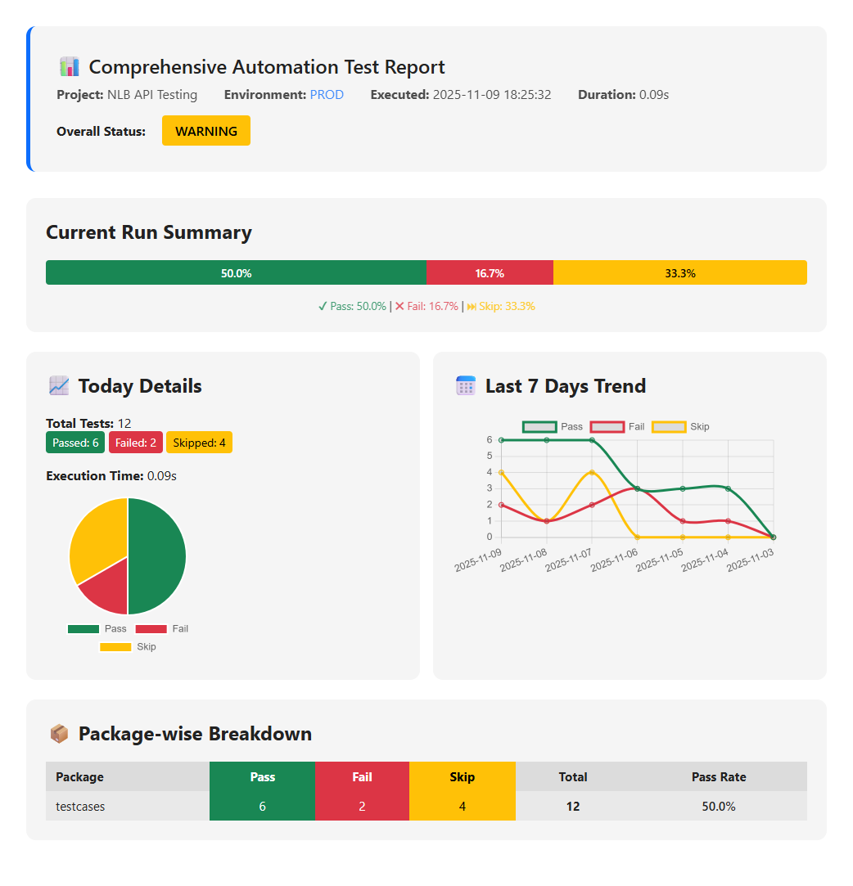
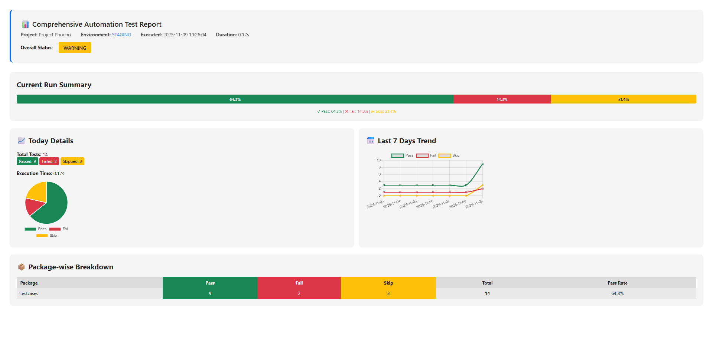

## 📊 Report Levels

## 📄 Basic Graph Report 

*Foundation-level test reporting with core functionality*

### 🎯 Features
- Automated test result collection via pytest hooks
- Package-wise & Environment-wise counters (pass/fail/skip).
- Rolling 7-day history (auto-purges older data).
- Single JSON file (test_metrics.json) – tiny, human-readable, git-friendly.
- Beautiful, modern HTML report (report-<env>-<time>.html) – dark/light toggle, charts, package & environment filters, execution timeline, last-7-day trend.
- E-mail the HTML report automatically (configurable SMTP).

### 🔧 Usage
```bash
pytest .\testcases\aiVoiceInterview\ --env staging -v

```

### 📊 Sample Test Structure
```python
import pytest

def test_login_page_loads_successfully():
    assert True

def test_user_can_login_with_valid_credentials():
    assert 1 == 1

def test_user_cannot_login_with_invalid_password():
    assert False, "Login failed with invalid password"

@pytest.mark.skip(reason="Payment gateway integration is pending.")
def test_checkout_process_completes_successfully():
    assert True
```

### 📧 Basic Email Report Preview


    

### 📝 Source Code - Basic Version

#### conftest.py (Basic)
```python
"""
Modern pytest conftest.py
- Enhanced header with project/env/time
- Progress bar visualization
- All existing charts + table
- Auto-purges >7 days
- Mails beautiful HTML report
"""
import json, os, smtplib, ssl, time, datetime as dt
from pathlib import Path
from email.message import EmailMessage
from typing import Dict, Any

import pytest
from _pytest.config import Config
from _pytest.reports import TestReport

# ------------------------------------------------------------------
# CONFIG – change only here
# ------------------------------------------------------------------
PROJECT_NAME = "NLB API Testing"  # <--- Add your project name here
ENVIRONMENTS = {"local", "staging", "prod"}
DEFAULT_ENV = "local"
METRICS_FILE = Path(__file__).with_name("test_metrics.json")
REPORT_DIR = Path(__file__).with_name("html_reports")
SMTP_SERVER = "smtp.gmail.com"
SMTP_PORT = 465
SMTP_USER = os.getenv("SMTP_USER")
SMTP_PASSWORD = os.getenv("SMTP_PASSWORD")
MAIL_TO = ["qa@mycompany.com"]


# ------------------------------------------------------------------

class MetricsCollector:
    def __init__(self) -> None:
        self._data: Dict[str, Any] = self._load()
        self.start_ts = time.time()

    # ---------- persistence ----------
    def _load(self) -> Dict[str, Any]:
        if METRICS_FILE.exists():
            return json.loads(METRICS_FILE.read_text())
        return {"history": {}}

    def _save(self) -> None:
        METRICS_FILE.parent.mkdir(exist_ok=True)
        METRICS_FILE.write_text(json.dumps(self._data, indent=2))

    def _purge_old(self) -> None:
        cutoff = (dt.date.today() - dt.timedelta(days=7)).isoformat()
        self._data["history"] = {
            d: v for d, v in self._data["history"].items() if d >= cutoff
        }

    # ---------- public ---------------
    def add_result(self, env: str, pkg: str, outcome: str) -> None:
        outcome_map = {"passed": "pass", "failed": "fail", "skipped": "skip"}
        metric_key = outcome_map.get(outcome)
        if not metric_key:
            print(f"⚠️ Unknown outcome '{outcome}', skipping")
            return

        today = dt.date.today().isoformat()
        history = self._data["history"]
        history.setdefault(today, {}).setdefault(env, {}).setdefault(pkg, {
            "pass": 0, "fail": 0, "skip": 0
        })[metric_key] += 1
        self._purge_old()
        self._save()

    def today_summary(self, env: str) -> Dict[str, Any]:
        today = dt.date.today().isoformat()
        env_data = self._data["history"].get(today, {}).get(env, {})
        totals = {"pass": 0, "fail": 0, "skip": 0, "total": 0}
        pkg_summary = {}
        for pkg, cnt in env_data.items():
            pkg_summary[pkg] = cnt
            for k in ("pass", "fail", "skip"):
                totals[k] += cnt.get(k, 0)
                totals["total"] += cnt.get(k, 0)
        return {"totals": totals, "packages": pkg_summary}

    def last7(self, env: str) -> Dict[str, Any]:
        days = [(dt.date.today() - dt.timedelta(d)).isoformat() for d in range(7)]
        series = {"pass": [], "fail": [], "skip": []}
        for day in days:
            day_data = self._data["history"].get(day, {}).get(env, {})
            for k in series:
                series[k].append(sum(v.get(k, 0) for v in day_data.values()))
        return {"days": days, "series": series}


# ------------------------------------------------------------------
# pytest hooks
# ------------------------------------------------------------------
_metrics = MetricsCollector()


def pytest_configure(config: Config):
    config._env = config.getoption("--env") or DEFAULT_ENV
    REPORT_DIR.mkdir(exist_ok=True)


def pytest_addoption(parser):
    parser.addoption("--env", choices=ENVIRONMENTS, default=DEFAULT_ENV)
    parser.addoption("--no-email", action="store_true")


@pytest.hookimpl(tryfirst=True, hookwrapper=True)
def pytest_runtest_makereport(item, call):
    outcome = yield
    rep: TestReport = outcome.get_result()

    # ✅ Only count once: when test phase == "call" OR when skipped during setup
    if rep.when == "call":
        record_outcome = rep.outcome
    elif rep.when == "setup" and rep.skipped:
        record_outcome = "skipped"
    else:
        return  # ignore setup/teardown duplicates

    pkg = rep.nodeid.split("/")[0] if "/" in rep.nodeid else "unknown"
    env = getattr(item.config, "_env", DEFAULT_ENV)
    _metrics.add_result(env, pkg, record_outcome)


def pytest_sessionfinish(session, exitstatus):
    env = session.config._env
    summary = _metrics.today_summary(env)
    last7 = _metrics.last7(env)
    html_path = REPORT_DIR / f"report-{env}-{dt.datetime.now():%Y%m%d-%H%M%S}.html"
    html = _build_html(summary, last7, env, time.time() - _metrics.start_ts)
    html_path.write_text(html, encoding="utf-8")
    print("\n📊 HTML report →", html_path)
    if not session.config.getoption("--no-email"):
        _send_email(html_path, env)


# ------------------------------------------------------------------
# HTML builder
# ------------------------------------------------------------------
def _build_html(summary: Dict[str, Any], last7: Dict[str, Any],
                env: str, duration: float) -> str:
    totals = summary["totals"]
    pkgs = summary["packages"]

    # Calculate percentages
    total = totals["total"]
    pass_pct = (totals["pass"] / total * 100) if total else 0
    fail_pct = (totals["fail"] / total * 100) if total else 0
    skip_pct = (totals["skip"] / total * 100) if total else 0

    # Determine overall status
    if totals["fail"] == 0:
        status = "SUCCESS"
        status_color = "#198754"
    elif totals["fail"] <= 5:
        status = "WARNING"
        status_color = "#ffc107"
    else:
        status = "FAILURE"
        status_color = "#dc3545"

    # Build table rows
    rows = ""
    for pkg, cnt in sorted(pkgs.items()):
        p = cnt.get("pass", 0)
        f = cnt.get("fail", 0)
        s = cnt.get("skip", 0)
        pkg_total = p + f + s
        rate = (p / pkg_total * 100) if pkg_total else 0
        rows += f"""
        <tr>
          <td style="text-align:left">{pkg}</td>
          <td class="pass">{p}</td>
          <td class="fail">{f}</td>
          <td class="skip">{s}</td>
          <td><strong>{pkg_total}</strong></td>
          <td class="rate">{rate:.1f}%</td>
        </tr>"""

    execution_time = dt.datetime.now().strftime("%Y-%m-%d %H:%M:%S")

    return f"""<!doctype html>
<html lang="en">
<head>
  <meta charset="utf-8">
  <title>Test Report – {env} – {dt.date.today()}</title>
  <meta name="viewport" content="width=device-width, initial-scale=1">
  <script src="https://cdn.jsdelivr.net/npm/chart.js"></script>
  <style>
    :root{{
      --bg:#ffffff;--fg:#222;--card:#f5f5f5;--acc:#0d6efd;
      --success:#198754;--warning:#ffc107;--danger:#dc3545;
    }}
    @media(prefers-color-scheme:dark){{
      :root{{--bg:#121212;--fg:#eee;--card:#1e1e1e;--acc:#0ea5e9;
             --success:#22c55e;--warning:#f59e0b;--danger:#ef4444;}}
    }}
    body{{
      font-family:system-ui,-apple-system,Segoe UI,Roboto,sans-serif;
      background:var(--bg);color:var(--fg);margin:0;padding:2rem;
    }}
    h1,h2{{margin-top:0}}
    .header{{
      background:var(--card);padding:2rem;border-radius:.75rem;margin-bottom:2rem;
      border-left:5px solid var(--acc);
    }}
    .project-title{{font-size:1.5rem;font-weight:600;margin-bottom:.5rem}}
    .meta{{display:flex;gap:2rem;flex-wrap:wrap;color:var(--fg);opacity:.8}}
    .status-badge{{
      display:inline-block;padding:.5rem 1rem;border-radius:.25rem;font-weight:600;
      margin-left:1rem;
    }}
    .status-success{{background:var(--success);color:#fff}}
    .status-warning{{background:var(--warning);color:#000}}
    .status-failure{{background:var(--danger);color:#fff}}
    .card{{
      background:var(--card);padding:1.5rem;border-radius:.75rem;margin-bottom:1.5rem;
    }}
    .badge{{
      display:inline-block;padding:.25rem .5rem;border-radius:.25rem;font-size:.875rem;
    }}
    .pass{{background:#198754;color:#fff}}
    .fail{{background:#dc3545;color:#fff}}
    .skip{{background:#ffc107;color:#000}}
    table{{
      width:100%;border-collapse:collapse;font-size:.95rem;
    }}
    th,td{{
      padding:.5rem .75rem;text-align:center;
    }}
    th{{
      background:rgba(0,0,0,.1);position:sticky;top:0;
    }}
    tbody tr:nth-child(odd){{
      background:rgba(0,0,0,.05);
    }}
    .rate{{
      font-weight:600;
    }}
    canvas{{max-height:250px}}

    /* Progress bar */
    .progress-bar-container{{
      width:100%;height:30px;background:rgba(0,0,0,.1);border-radius:4px;
      overflow:hidden;margin:1rem 0;display:flex;
    }}
    .progress-bar-pass,.progress-bar-fail,.progress-bar-skip{{
      height:100%;display:flex;align-items:center;justify-content:center;
      color:#fff;font-weight:600;font-size:.85rem;transition:width .3s;
    }}
    .progress-bar-pass{{background:var(--success)}}
    .progress-bar-fail{{background:var(--danger)}}
    .progress-bar-skip{{background:var(--warning);color:#000}}
  </style>
</head>
<body>
  <!-- HEADER -->
  <div class="header">
    <div class="project-title">📊 Comprehensive Automation Test Report</div>
    <div class="meta">
      <div><strong>Project:</strong> {PROJECT_NAME}</div>
      <div><strong>Environment:</strong> <span style="color:var(--acc)">{env.upper()}</span></div>
      <div><strong>Executed:</strong> {execution_time}</div>
      <div><strong>Duration:</strong> {duration:.2f}s</div>
    </div>
    <div style="margin-top:1rem">
      <strong>Overall Status:</strong>
      <span class="status-badge status-{status.lower()}" style="background:{status_color}">{status}</span>
    </div>
  </div>

  <!-- PROGRESS BAR SECTION -->
  <div class="card">
    <h2>Current Run Summary</h2>
    <div class="progress-bar-container">
      <div class="progress-bar-pass" style="width:{pass_pct:.2f}%;">
        {pass_pct:.1f}%
      </div>
      <div class="progress-bar-fail" style="width:{fail_pct:.2f}%;">
        {fail_pct:.1f}%
      </div>
      <div class="progress-bar-skip" style="width:{skip_pct:.2f}%;">
        {skip_pct:.1f}%
      </div>
    </div>
    <p style="text-align:center;font-size:.85rem;color:var(--fg);opacity:.8;margin:0">
      <span style="color:var(--success)">✔ Pass: {pass_pct:.1f}%</span> |
      <span style="color:var(--danger)">✖ Fail: {fail_pct:.1f}%</span> |
      <span style="color:var(--warning)">⏭ Skip: {skip_pct:.1f}%</span>
    </p>
  </div>

  <!-- CHARTS GRID -->
  <div class="grid" style="display:grid;gap:1rem;grid-template-columns:repeat(auto-fit,minmax(260px,1fr))">
    <!-- TODAY TOTALS + PIE -->
    <div class="card">
      <h2>📈 Today Details</h2>
      <p>
        <strong>Total Tests:</strong> {totals["total"]}<br>
        <span class="badge pass">Passed: {totals["pass"]}</span>
        <span class="badge fail">Failed: {totals["fail"]}</span>
        <span class="badge skip">Skipped: {totals["skip"]}</span>
      </p>
      <p><strong>Execution Time:</strong> {duration:.2f}s</p>
      <div style="height:200px"><canvas id="pieToday"></canvas></div>
    </div>

    <!-- 7-DAY TREND -->
    <div class="card">
      <h2>📅 Last 7 Days Trend</h2>
      <div style="height:200px"><canvas id="trendChart"></canvas></div>
    </div>
  </div>

  <!-- PACKAGE TABLE -->
  <div class="card">
    <h2>📦 Package-wise Breakdown</h2>
    <div style="overflow-x:auto;">
      <table>
        <thead>
          <tr>
            <th style="text-align:left">Package</th>
            <th class="pass">Pass</th>
            <th class="fail">Fail</th>
            <th class="skip">Skip</th>
            <th>Total</th>
            <th>Pass Rate</th>
          </tr>
        </thead>
        <tbody>{rows}</tbody>
      </table>
    </div>
  </div>

  <script>
    // Pie – today
    new Chart(document.getElementById('pieToday'),{{
      type:'pie',
      data:{{
        labels:['Pass','Fail','Skip'],
        datasets:[{{
          data:[{totals["pass"]},{totals["fail"]},{totals["skip"]}],
          backgroundColor:['#198754','#dc3545','#ffc107']
        }}]
      }},
      options:{{plugins:{{legend:{{position:'bottom'}}}}}}
    }});

    // Trend line – 7 days
    new Chart(document.getElementById('trendChart'),{{
      type:'line',
      data:{{
        labels:{last7["days"]!r},
        datasets:[
          {{label:'Pass',data:{last7["series"]["pass"]!r},borderColor:'#198754',fill:false,tension:0.3}},
          {{label:'Fail',data:{last7["series"]["fail"]!r},borderColor:'#dc3545',fill:false,tension:0.3}},
          {{label:'Skip',data:{last7["series"]["skip"]!r},borderColor:'#ffc107',fill:false,tension:0.3}}
        ]
      }},
      options:{{plugins:{{legend:{{display:true}}}},scales:{{y:{{beginAtZero:true}}}}}}
    }});
  </script>
</body>
</html>"""


# ------------------------------------------------------------------
# Email helper
# ------------------------------------------------------------------
def _send_email(html_path: Path, env: str):
    if not (SMTP_USER and SMTP_PASSWORD):
        print("⚠️  SMTP credentials missing – skipping e-mail")
        return
    msg = EmailMessage()
    msg["Subject"] = f"pytest report – {env} – {dt.date.today()}"
    msg["From"] = SMTP_USER
    msg["To"] = MAIL_TO
    msg.add_alternative(html_path.read_text(), subtype="html")

    context = ssl.create_default_context()
    with smtplib.SMTP_SSL(SMTP_SERVER, SMTP_PORT, context=context) as smtp:
        smtp.login(SMTP_USER, SMTP_PASSWORD)
        smtp.send_message(msg)
    print("📧 Report mailed to", MAIL_TO)
```
### report_data.json - Test Results Data Storage

```json
{
  "history": {
    "2025-11-04": {
      "prod": {
        "testcases": {
          "pass": 3,
          "fail": 1,
          "skip": 0
        }
      }
    },
    "2025-11-05": {
      "prod": {
        "testcases": {
          "pass": 3,
          "fail": 1,
          "skip": 0
        }
      }
    },
    "2025-11-06": {
      "prod": {
        "testcases": {
          "pass": 3,
          "fail": 3,
          "skip": 0
        }
      }
    },
    "2025-11-07": {
      "prod": {
        "testcases": {
          "pass": 6,
          "fail": 2,
          "skip": 4
        }
      }
    },
    "2025-11-08": {
      "prod": {
        "testcases": {
          "pass": 6,
          "fail": 1,
          "skip": 1
        }
      }
    },
    "2025-11-09": {
      "prod": {
        "testcases": {
          "pass": 6,
          "fail": 2,
          "skip": 4
        }
      },
      "staging": {
        "testcases": {
          "pass": 3,
          "fail": 1,
          "skip": 0
        }
      }
    }
  }
}
```
## 📊 Report Levels -2

## 📄 Advance  Graph Report 

*Foundation-level test reporting with core functionality*

### 🎯 Features
- Automated test result collection via pytest hooks
- Package-wise & Environment-wise counters (pass/fail/skip).
- Rolling 7-day history (auto-purges older data).
- Single JSON file (test_metrics.json) – tiny, human-readable, git-friendly.
- Beautiful, modern HTML report (report-<env>-<time>.html) – dark/light toggle, charts, package & environment filters, execution timeline, last-7-day trend.
- E-mail the HTML report automatically (configurable SMTP).

### 🔧 Usage
```bash
pytest .\testcases\aiVoiceInterview\ --env staging -v

```

### 📊 Sample Test Structure
```python
import pytest

def test_login_page_loads_successfully():
    assert True

def test_user_can_login_with_valid_credentials():
    assert 1 == 1

def test_user_cannot_login_with_invalid_password():
    assert False, "Login failed with invalid password"

@pytest.mark.skip(reason="Payment gateway integration is pending.")
def test_checkout_process_completes_successfully():
    assert True
```

### 📧  Email Report Preview


    

### 📝 Source Code - Basic Version

#### conftest.py (Basic)
```python
from __future__ import annotations
import json, os, smtplib, ssl, time, datetime as dt
from pathlib import Path
from email.message import EmailMessage
from typing import Dict, Any

import pytest
from _pytest.config import Config
from _pytest.reports import TestReport

# ------------------------------------------------------------------
# CONFIG – change only here
# ------------------------------------------------------------------
PROJECT_NAME = "Project Phoenix"  # Your project name
ENVIRONMENTS = {"dev", "staging", "prod"}
DEFAULT_ENV = "dev"
METRICS_FILE = Path(__file__).with_name("test_metrics.json")
REPORT_DIR = Path(__file__).with_name("html_reports")
SMTP_SERVER = "smtp.gmail.com"
SMTP_PORT = 465
SMTP_USER = os.getenv("SMTP_USER")
SMTP_PASSWORD = os.getenv("SMTP_PASSWORD")
MAIL_TO = ["qa@mycompany.com"]


# ------------------------------------------------------------------

class MetricsCollector:
    def __init__(self) -> None:
        self._data: Dict[str, Any] = self._load()
        self.start_ts = time.time()

    # ---------- persistence ----------
    def _load(self) -> Dict[str, Any]:
        if METRICS_FILE.exists():
            data = json.loads(METRICS_FILE.read_text())
        else:
            data = {
                "report_title": "Comprehensive Automation Test Report",
                "project_name": PROJECT_NAME,
                "environments": {}
            }

        # Ensure all environments exist
        for env in ENVIRONMENTS:
            data["environments"].setdefault(env, {"trend_data": []})

        return data

    def _save(self) -> None:
        METRICS_FILE.parent.mkdir(exist_ok=True)
        METRICS_FILE.write_text(json.dumps(self._data, indent=2))

    def _delete_old_data(self) -> None:
        """Keep only last 7 days per environment"""
        cutoff_date = dt.date.today() - dt.timedelta(days=7)
        for env_data in self._data["environments"].values():
            env_data["trend_data"] = [
                entry for entry in env_data["trend_data"]
                if dt.date.fromisoformat(entry["date"]) >= cutoff_date
            ]

    # ---------- public ---------------
    def add_result(self, env: str, pkg: str, outcome: str) -> None:
        # Map pytest outcome to JSON keys (full words)
        outcome_map = {"passed": "passed", "failed": "failed", "skipped": "skipped"}
        metric_key = outcome_map.get(outcome)
        if not metric_key:
            print(f"⚠️ Unknown outcome '{outcome}', skipping")
            return

        today = dt.date.today().isoformat()
        timestamp = dt.datetime.now().strftime("%Y-%m-%d %H:%M:%S")

        # Get environment data
        env_data = self._data["environments"][env]
        trend_data = env_data["trend_data"]

        # Find or create today's entry
        today_entry = next((e for e in trend_data if e["date"] == today), None)

        if not today_entry:
            today_entry = {
                "date": today,
                "timestamp": timestamp,
                "total": 0,
                "passed": 0,
                "failed": 0,
                "skipped": 0,
                "package_summary": {}
            }
            trend_data.append(today_entry)

        # Update totals
        today_entry["total"] += 1
        today_entry[metric_key] += 1
        today_entry["timestamp"] = timestamp  # Update to latest

        # Update package summary
        pkg_summary = today_entry["package_summary"].setdefault(pkg, {
            "passed": 0, "failed": 0, "skipped": 0, "total": 0
        })
        pkg_summary["total"] += 1
        pkg_summary[metric_key] += 1

        self._delete_old_data()
        self._save()

    def today_summary(self, env: str) -> Dict[str, Any]:
        """Return today's data in format expected by HTML generator"""
        today = dt.date.today().isoformat()
        env_data = self._data["environments"].get(env, {"trend_data": []})

        # Find today's entry
        today_entry = next((e for e in env_data["trend_data"] if e["date"] == today), None)

        if not today_entry:
            return {
                "totals": {"pass": 0, "fail": 0, "skip": 0, "total": 0},
                "packages": {}
            }

        # Convert to format expected by HTML (short keys for classes)
        packages = {}
        for pkg, data in today_entry["package_summary"].items():
            packages[pkg] = {
                "pass": data["passed"],
                "fail": data["failed"],
                "skip": data["skipped"]
            }

        return {
            "totals": {
                "pass": today_entry["passed"],
                "fail": today_entry["failed"],
                "skip": today_entry["skipped"],
                "total": today_entry["total"]
            },
            "packages": packages
        }

    def last7(self, env: str) -> Dict[str, Any]:
        """Return last 7 days data for trend chart"""
        env_data = self._data["environments"].get(env, {"trend_data": []})
        # Get last 7 entries sorted by date
        sorted_data = sorted(env_data["trend_data"], key=lambda x: x["date"])[-7:]

        days = []
        passed = []
        failed = []
        skipped = []

        for entry in sorted_data:
            days.append(entry["date"])
            passed.append(entry["passed"])
            failed.append(entry["failed"])
            skipped.append(entry["skipped"])

        return {"days": days, "series": {"pass": passed, "fail": failed, "skip": skipped}}

    def get_project_info(self) -> Dict[str, str]:
        """Return project metadata"""
        return {
            "title": self._data.get("report_title", "Comprehensive Automation Test Report"),
            "name": self._data.get("project_name", PROJECT_NAME)
        }


# ------------------------------------------------------------------
# pytest hooks
# ------------------------------------------------------------------
_metrics = MetricsCollector()


def pytest_configure(config: Config):
    config._env = config.getoption("--env") or DEFAULT_ENV
    REPORT_DIR.mkdir(exist_ok=True)


def pytest_addoption(parser):
    parser.addoption("--env", choices=ENVIRONMENTS, default=DEFAULT_ENV)
    parser.addoption("--no-email", action="store_true")


@pytest.hookimpl(tryfirst=True, hookwrapper=True)
def pytest_runtest_makereport(item, call):
    outcome = yield
    rep: TestReport = outcome.get_result()
    if rep.when != "call" and rep.outcome != "skipped":
        return
    pkg = rep.nodeid.split("/")[0] if "/" in rep.nodeid else "unknown"
    env = item.config._env
    _metrics.add_result(env, pkg, rep.outcome)


def pytest_sessionfinish(session, exitstatus):
    env = session.config._env
    summary = _metrics.today_summary(env)
    last7 = _metrics.last7(env)
    project_info = _metrics.get_project_info()

    html_path = REPORT_DIR / f"report-{env}-{dt.datetime.now():%Y%m%d-%H%M%S}.html"
    html = _build_html(summary, last7, env, time.time() - _metrics.start_ts, project_info)
    html_path.write_text(html, encoding="utf-8")
    print("\n📊 HTML report →", html_path)
    if not session.config.getoption("--no-email"):
        _send_email(html_path, env)


# ------------------------------------------------------------------
# HTML builder
# ------------------------------------------------------------------
def _build_html(summary: Dict[str, Any], last7: Dict[str, Any],
                env: str, duration: float, project_info: Dict[str, str]) -> str:
    totals = summary["totals"]
    pkgs = summary["packages"]

    total = totals["total"]
    pass_pct = (totals["pass"] / total * 100) if total else 0
    fail_pct = (totals["fail"] / total * 100) if total else 0
    skip_pct = (totals["skip"] / total * 100) if total else 0

    # Determine overall status
    if totals["fail"] == 0:
        status = "SUCCESS"
        status_color = "var(--success)"
    elif totals["fail"] <= 5:
        status = "WARNING"
        status_color = "var(--warning)"
    else:
        status = "FAILURE"
        status_color = "var(--danger)"

    # Build table rows
    rows = ""
    for pkg, cnt in sorted(pkgs.items()):
        p = cnt.get("pass", 0)
        f = cnt.get("fail", 0)
        s = cnt.get("skip", 0)
        pkg_total = p + f + s
        rate = (p / pkg_total * 100) if pkg_total else 0
        rows += f"""
        <tr>
          <td style="text-align:left">{pkg}</td>
          <td class="pass">{p}</td>
          <td class="fail">{f}</td>
          <td class="skip">{s}</td>
          <td><strong>{pkg_total}</strong></td>
          <td class="rate">{rate:.1f}%</td>
        </tr>"""

    execution_time = dt.datetime.now().strftime("%Y-%m-%d %H:%M:%S")

    return f"""<!doctype html>
<html lang="en">
<head>
  <meta charset="utf-8">
  <title>Test Report – {env} – {dt.date.today()}</title>
  <meta name="viewport" content="width=device-width, initial-scale=1">
  <script src="https://cdn.jsdelivr.net/npm/chart.js"></script>
  <style>
    :root{{
      --bg:#ffffff;--fg:#222;--card:#f5f5f5;--acc:#0d6efd;
      --success:#198754;--warning:#ffc107;--danger:#dc3545;
    }}
    @media(prefers-color-scheme:dark){{
      :root{{--bg:#121212;--fg:#eee;--card:#1e1e1e;--acc:#0ea5e9;
             --success:#22c55e;--warning:#f59e0b;--danger:#ef4444;}}
    }}
    body{{
      font-family:system-ui,-apple-system,Segoe UI,Roboto,sans-serif;
      background:var(--bg);color:var(--fg);margin:0;padding:2rem;
    }}
    h1,h2{{margin-top:0}}
    .header{{
      background:var(--card);padding:2rem;border-radius:.75rem;margin-bottom:2rem;
      border-left:5px solid var(--acc);
    }}
    .project-title{{font-size:1.5rem;font-weight:600;margin-bottom:.5rem}}
    .meta{{display:flex;gap:2rem;flex-wrap:wrap;color:var(--fg);opacity:.8}}
    .status-badge{{
      display:inline-block;padding:.5rem 1rem;border-radius:.25rem;font-weight:600;
      margin-left:1rem;
    }}
    .card{{
      background:var(--card);padding:1.5rem;border-radius:.75rem;margin-bottom:1.5rem;
    }}
    .badge{{
      display:inline-block;padding:.25rem .5rem;border-radius:.25rem;font-size:.875rem;
    }}
    .pass{{background:#198754;color:#fff}}
    .fail{{background:#dc3545;color:#fff}}
    .skip{{background:#ffc107;color:#000}}
    table{{
      width:100%;border-collapse:collapse;font-size:.95rem;
    }}
    th,td{{
      padding:.5rem .75rem;text-align:center;
    }}
    th{{
      background:rgba(0,0,0,.1);position:sticky;top:0;
    }}
    tbody tr:nth-child(odd){{
      background:rgba(0,0,0,.05);
    }}
    .rate{{
      font-weight:600;
    }}
    canvas{{max-height:250px}}

    /* Progress bar */
    .progress-bar-container{{
      width:100%;height:30px;background:rgba(0,0,0,.1);border-radius:4px;
      overflow:hidden;margin:1rem 0;display:flex;
    }}
    .progress-bar-pass,.progress-bar-fail,.progress-bar-skip{{
      height:100%;display:flex;align-items:center;justify-content:center;
      color:#fff;font-weight:600;font-size:.85rem;transition:width .3s;
    }}
    .progress-bar-pass{{background:var(--success)}}
    .progress-bar-fail{{background:var(--danger)}}
    .progress-bar-skip{{background:var(--warning);color:#000}}
  </style>
</head>
<body>
  <!-- HEADER -->
  <div class="header">
    <div class="project-title">📊 {project_info["title"]}</div>
    <div class="meta">
      <div><strong>Project:</strong> {project_info["name"]}</div>
      <div><strong>Environment:</strong> <span style="color:var(--acc)">{env.upper()}</span></div>
      <div><strong>Executed:</strong> {execution_time}</div>
      <div><strong>Duration:</strong> {duration:.2f}s</div>
    </div>
    <div style="margin-top:1rem">
      <strong>Overall Status:</strong>
      <span class="status-badge" style="background:{status_color}">{status}</span>
    </div>
  </div>

  <!-- PROGRESS BAR SECTION -->
  <div class="card">
    <h2>Current Run Summary</h2>
    <div class="progress-bar-container">
      <div class="progress-bar-pass" style="width:{pass_pct:.2f}%;">
        {pass_pct:.1f}%
      </div>
      <div class="progress-bar-fail" style="width:{fail_pct:.2f}%;">
        {fail_pct:.1f}%
      </div>
      <div class="progress-bar-skip" style="width:{skip_pct:.2f}%;">
        {skip_pct:.1f}%
      </div>
    </div>
    <p style="text-align:center;font-size:.85rem;color:var(--fg);opacity:.8;margin:0">
      <span style="color:var(--success)">✔ Pass: {pass_pct:.1f}%</span> |
      <span style="color:var(--danger)">✖ Fail: {fail_pct:.1f}%</span> |
      <span style="color:var(--warning)">⏭ Skip: {skip_pct:.1f}%</span>
    </p>
  </div>

  <!-- CHARTS GRID -->
  <div class="grid" style="display:grid;gap:1rem;grid-template-columns:repeat(auto-fit,minmax(260px,1fr))">
    <!-- TODAY TOTALS + PIE -->
    <div class="card">
      <h2>📈 Today Details</h2>
      <p>
        <strong>Total Tests:</strong> {totals["total"]}<br>
        <span class="badge pass">Passed: {totals["pass"]}</span>
        <span class="badge fail">Failed: {totals["fail"]}</span>
        <span class="badge skip">Skipped: {totals["skip"]}</span>
      </p>
      <p><strong>Execution Time:</strong> {duration:.2f}s</p>
      <div style="height:200px"><canvas id="pieToday"></canvas></div>
    </div>

    <!-- 7-DAY TREND -->
    <div class="card">
      <h2>📅 Last 7 Days Trend</h2>
      <div style="height:200px"><canvas id="trendChart"></canvas></div>
    </div>
  </div>

  <!-- PACKAGE TABLE -->
  <div class="card">
    <h2>📦 Package-wise Breakdown</h2>
    <div style="overflow-x:auto;">
      <table>
        <thead>
          <tr>
            <th style="text-align:left">Package</th>
            <th class="pass">Pass</th>
            <th class="fail">Fail</th>
            <th class="skip">Skip</th>
            <th>Total</th>
            <th>Pass Rate</th>
          </tr>
        </thead>
        <tbody>{rows}</tbody>
      </table>
    </div>
  </div>

  <script>
    // Pie – today
    new Chart(document.getElementById('pieToday'),{{
      type:'pie',
      data:{{
        labels:['Pass','Fail','Skip'],
        datasets:[{{
          data:[{totals["pass"]},{totals["fail"]},{totals["skip"]}],
          backgroundColor:['#198754','#dc3545','#ffc107']
        }}]
      }},
      options:{{plugins:{{legend:{{position:'bottom'}}}}}}
    }});

    // Trend line – 7 days
    new Chart(document.getElementById('trendChart'),{{
      type:'line',
      data:{{
        labels:{last7["days"]!r},
        datasets:[
          {{label:'Pass',data:{last7["series"]["pass"]!r},borderColor:'#198754',fill:false,tension:0.3}},
          {{label:'Fail',data:{last7["series"]["fail"]!r},borderColor:'#dc3545',fill:false,tension:0.3}},
          {{label:'Skip',data:{last7["series"]["skip"]!r},borderColor:'#ffc107',fill:false,tension:0.3}}
        ]
      }},
      options:{{plugins:{{legend:{{display:true}}}},scales:{{y:{{beginAtZero:true}}}}}}
    }});
  </script>
</body>
</html>"""


# ------------------------------------------------------------------
# Email helper
# ------------------------------------------------------------------
def _send_email(html_path: Path, env: str):
    if not (SMTP_USER and SMTP_PASSWORD):
        print("⚠️  SMTP credentials missing – skipping e-mail")
        return
    msg = EmailMessage()
    msg["Subject"] = f"{_metrics.get_project_info()['title']} – {env} – {dt.date.today()}"
    msg["From"] = SMTP_USER
    msg["To"] = MAIL_TO
    msg.add_alternative(html_path.read_text(), subtype="html")

    context = ssl.create_default_context()
    with smtplib.SMTP_SSL(SMTP_SERVER, SMTP_PORT, context=context) as smtp:
        smtp.login(SMTP_USER, SMTP_PASSWORD)
        smtp.send_message(msg)
    print("📧 Report mailed to", MAIL_TO)
```
### report_data.json - Test Results Data Storage

```json
{
  "report_title": "Comprehensive Automation Test Report",
  "project_name": "Project Phoenix",
  "environments": {
    "staging": {
      "trend_data": [
        {
          "date": "2025-11-02",
          "timestamp": "2025-11-02 19:19:14",
          "total": 4,
          "passed": 3,
          "failed": 1,
          "skipped": 0,
          "package_summary": {
            "testcases": {
              "passed": 3,
              "failed": 1,
              "skipped": 0,
              "total": 4
            }
          }
        },
        {
          "date": "2025-11-03",
          "timestamp": "2025-11-03 19:19:34",
          "total": 4,
          "passed": 3,
          "failed": 1,
          "skipped": 0,
          "package_summary": {
            "testcases": {
              "passed": 3,
              "failed": 1,
              "skipped": 0,
              "total": 4
            }
          }
        },
        {
          "date": "2025-11-04",
          "timestamp": "2025-11-04 19:19:52",
          "total": 4,
          "passed": 3,
          "failed": 1,
          "skipped": 0,
          "package_summary": {
            "testcases": {
              "passed": 3,
              "failed": 1,
              "skipped": 0,
              "total": 4
            }
          }
        },
        {
          "date": "2025-11-05",
          "timestamp": "2025-11-05 19:20:16",
          "total": 4,
          "passed": 3,
          "failed": 1,
          "skipped": 0,
          "package_summary": {
            "testcases": {
              "passed": 3,
              "failed": 1,
              "skipped": 0,
              "total": 4
            }
          }
        },
        {
          "date": "2025-11-06",
          "timestamp": "2025-11-06 19:20:33",
          "total": 4,
          "passed": 3,
          "failed": 1,
          "skipped": 0,
          "package_summary": {
            "testcases": {
              "passed": 3,
              "failed": 1,
              "skipped": 0,
              "total": 4
            }
          }
        },
        {
          "date": "2025-11-07",
          "timestamp": "2025-11-07 19:20:51",
          "total": 4,
          "passed": 3,
          "failed": 1,
          "skipped": 0,
          "package_summary": {
            "testcases": {
              "passed": 3,
              "failed": 1,
              "skipped": 0,
              "total": 4
            }
          }
        },
        {
          "date": "2025-11-08",
          "timestamp": "2025-11-08 19:21:06",
          "total": 4,
          "passed": 3,
          "failed": 1,
          "skipped": 0,
          "package_summary": {
            "testcases": {
              "passed": 3,
              "failed": 1,
              "skipped": 0,
              "total": 4
            }
          }
        },
        {
          "date": "2025-11-09",
          "timestamp": "2025-11-09 19:26:04",
          "total": 14,
          "passed": 9,
          "failed": 2,
          "skipped": 3,
          "package_summary": {
            "testcases": {
              "passed": 9,
              "failed": 2,
              "skipped": 3,
              "total": 14
            }
          }
        }
      ]
    },
    "dev": {
      "trend_data": []
    },
    "prod": {
      "trend_data": []
    }
  }
}
```
