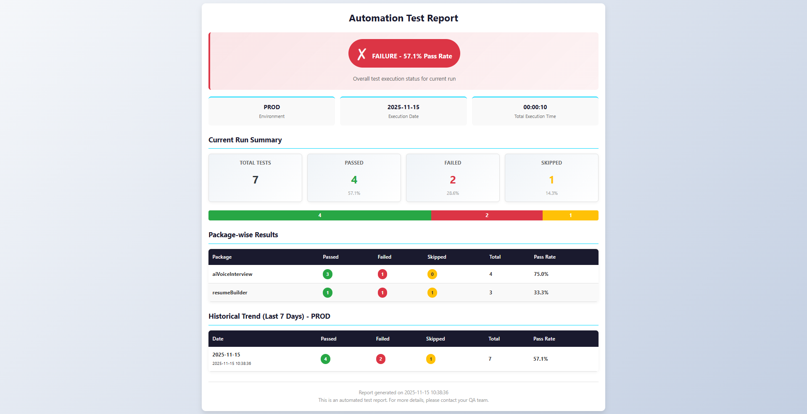

## 📊 Report Levels

## 📄 New Report 

*Foundation-level test reporting with core functionality*

### 🎯 Features
✓ Execution Time Tracking: Shows total time from test start to finish in hh:mm:ss format
✓ No Duplicates: Same date + environment = update existing entry
✓ Environment-Specific: Data organized by environment (staging, prod, etc.)
✓ 7-Day Retention: Automatic cleanup of data older than 7 days
✓ Mobile-Friendly: Responsive design with proper formatting
✓ Overall Status: Pass/Warning/Failure indicator based on pass percentage
✓ Automated test result collection via pytest hooks
✓  Package-wise & Environment-wise counters (pass/fail/skip).
✓  Single JSON file (test_metrics.json) – tiny, human-readable, git-friendly.
✓  E-mail the HTML report automatically (configurable SMTP).

### 🔧 Usage
```bash
pytest .\testcases\ --env staging -v

```

### 📊 Sample Test Structure
```python
import pytest

def test_login_page_loads_successfully():
    assert True

def test_user_can_login_with_valid_credentials():
    assert 1 == 1

def test_user_cannot_login_with_invalid_password():
    assert False, "Login failed with invalid password"

@pytest.mark.skip(reason="Payment gateway integration is pending.")
def test_checkout_process_completes_successfully():
    assert True
```

### 📧 Basic Email Report Preview


    

### 📝 Source Code 

#### conftest.py 
```python
import pytest
import json
import os
import datetime
from collections import defaultdict
from typing import Dict, Any, List

# Import report utilities
try:
    from report_utils import generate_html_report, send_email_report
except ImportError:
    def generate_html_report(*args, **kwargs):
        print("WARNING: report_utils.generate_html_report not found. Skipping HTML report generation.")


    def send_email_report(*args, **kwargs):
        print("WARNING: report_utils.send_email_report not found. Skipping email sending.")

# --- Configuration ---
REPORT_DIR = "test_reports"
HISTORY_FILE = os.path.join(REPORT_DIR, "test_history.json")
HTML_REPORT_FILE = os.path.join(REPORT_DIR, "latest_report.html")
HISTORY_DAYS = 7


# --- Helper Functions ---

def load_history() -> Dict[str, Any]:
    """Loads the test history from the JSON file."""
    if not os.path.exists(HISTORY_FILE):
        return {
            "report_title": "Comprehensive Automation Test Report",
            "project_name": "Test Automation Project",
            "environments": {}
        }
    try:
        with open(HISTORY_FILE, 'r') as f:
            return json.load(f)
    except (json.JSONDecodeError, FileNotFoundError):
        return {
            "report_title": "Comprehensive Automation Test Report",
            "project_name": "Test Automation Project",
            "environments": {}
        }


def save_history(history: Dict[str, Any]):
    """Saves the test history to the JSON file, ensuring the directory exists."""
    os.makedirs(REPORT_DIR, exist_ok=True)
    with open(HISTORY_FILE, 'w') as f:
        json.dump(history, f, indent=4)


def clean_old_history(history: Dict[str, Any]):
    """Removes test runs older than HISTORY_DAYS for each environment."""
    cutoff_date = datetime.datetime.now() - datetime.timedelta(days=HISTORY_DAYS)

    for env in history.get("environments", {}):
        trend_data = history["environments"][env].get("trend_data", [])
        new_trend_data = []

        for run in trend_data:
            try:
                timestamp_str = run.get('timestamp')
                if not timestamp_str:
                    continue

                run_date = datetime.datetime.strptime(timestamp_str, "%Y-%m-%d %H:%M:%S")
                if run_date >= cutoff_date:
                    new_trend_data.append(run)
            except ValueError:
                # Discard runs with invalid timestamps
                pass

        history["environments"][env]["trend_data"] = new_trend_data


def format_execution_time(delta: datetime.timedelta) -> str:
    """
    Converts a timedelta object to hh:mm:ss format.
    Example: 0:00:15.123456 -> "00:00:15"
    """
    total_seconds = int(delta.total_seconds())
    hours = total_seconds // 3600
    minutes = (total_seconds % 3600) // 60
    seconds = total_seconds % 60
    return f"{hours:02d}:{minutes:02d}:{seconds:02d}"


def find_and_update_entry(history: Dict[str, Any], environment: str, current_date: str,
                          new_run_data: Dict[str, Any]) -> bool:
    """
    Checks if an entry exists for the same date and environment.
    If found, updates it and returns True.
    If not found, returns False (indicating a new entry should be added).
    """
    if environment not in history.get("environments", {}):
        return False

    trend_data = history["environments"][environment].get("trend_data", [])

    for i, run in enumerate(trend_data):
        if run.get("date") == current_date:
            # Found an entry for the same date and environment
            # Update it with new data
            history["environments"][environment]["trend_data"][i] = new_run_data
            return True

    return False


# --- Pytest Hooks ---

def pytest_addoption(parser):
    """Adds custom command-line options for environment and email."""
    parser.addoption(
        "--env", action="store", default="staging", help="Environment to run tests against (e.g., dev, staging, prod)"
    )
    parser.addoption(
        "--email-to", action="store", default="", help="Comma-separated list of email addresses to send the report to"
    )


@pytest.hookimpl(tryfirst=True, hookwrapper=True)
def pytest_runtestloop(session):
    """Hook to capture the start time of the test session."""
    session.start_time = datetime.datetime.now()
    yield


@pytest.hookimpl(hookwrapper=True)
def pytest_runtest_makereport(item, call):
    """Hook to capture the result of each test item."""
    outcome = yield
    report = outcome.get_result()

    # Initialize custom session attribute if it doesn't exist
    if not hasattr(item.session, 'test_results'):
        item.session.test_results = {
            "total_tests": 0,
            "passed": 0,
            "failed": 0,
            "skipped": 0,
            "package_results": defaultdict(lambda: {"passed": 0, "failed": 0, "skipped": 0})
        }

    # Only process the 'call' phase for pass/fail/skip
    if report.when == 'call':

        try:
            filepath = item.fspath  # full path to test file
            package_name = os.path.basename(os.path.dirname(str(filepath)))
        except (ValueError, IndexError):
            pass

        # Aggregate results
        item.session.test_results["total_tests"] += 1

        if report.passed:
            item.session.test_results["passed"] += 1
            item.session.test_results["package_results"][package_name]["passed"] += 1
        elif report.failed:
            item.session.test_results["failed"] += 1
            item.session.test_results["package_results"][package_name]["failed"] += 1
        elif report.skipped:
            item.session.test_results["skipped"] += 1
            item.session.test_results["package_results"][package_name]["skipped"] += 1


def pytest_sessionfinish(session):
    """Hook to process results after the entire test session finishes."""

    # 1. Calculate execution time
    end_time = datetime.datetime.now()
    start_time = getattr(session, 'start_time', end_time)
    execution_delta = end_time - start_time
    execution_time_formatted = format_execution_time(execution_delta)

    # Get results from the custom attribute
    results = getattr(session, 'test_results', {
        "total_tests": 0, "passed": 0, "failed": 0, "skipped": 0,
        "package_results": defaultdict(lambda: {"passed": 0, "failed": 0, "skipped": 0})
    })

    # Get environment
    environment = session.config.getoption("env")
    current_date = end_time.strftime("%Y-%m-%d")
    current_timestamp = end_time.strftime("%Y-%m-%d %H:%M:%S")

    # 2. Build package_summary from package_results (simplified, no tag structure)
    package_summary = {}
    for package_name, pkg_results in results["package_results"].items():
        package_summary[package_name] = {
            "passed": pkg_results["passed"],
            "failed": pkg_results["failed"],
            "skipped": pkg_results["skipped"],
            "total": pkg_results["passed"] + pkg_results["failed"] + pkg_results["skipped"]
        }

    # 3. Create current run data in the new format
    current_run_data = {
        "date": current_date,
        "timestamp": current_timestamp,
        "execution_time": execution_time_formatted,
        "total": results["total_tests"],
        "passed": results["passed"],
        "failed": results["failed"],
        "skipped": results["skipped"],
        "package_summary": package_summary
    }

    # 4. Load history and update with new data
    history = load_history()

    # Ensure the environment exists in the history
    if environment not in history["environments"]:
        history["environments"][environment] = {
            "trend_data": []
        }

    # Check if entry exists for same date and environment
    # If yes, update it; if no, add new entry
    entry_updated = find_and_update_entry(history, environment, current_date, current_run_data)

    if not entry_updated:
        # Add as new entry only if it doesn't exist
        history["environments"][environment]["trend_data"].append(current_run_data)

    # 5. Clean old history (older than 7 days)
    clean_old_history(history)

    # 6. Save history
    save_history(history)

    # 7. Generate HTML Report
    generate_html_report(current_run_data, history, environment)

    # 8. Send Email
    recipients = session.config.getoption("email_to")
    if recipients:
        send_email_report(HTML_REPORT_FILE, recipients, current_run_data)
    else:
        print("Email not sent: No recipients specified. Use --email-to option.")

```
### report_utils 
```python
import json
import os
import datetime
from typing import Dict, Any, List
from email.mime.multipart import MIMEMultipart
from email.mime.text import MIMEText
from email.mime.application import MIMEApplication
import smtplib
from collections import defaultdict

# --- Configuration (Should be consistent with conftest.py) ---
REPORT_DIR = "test_reports"
HTML_REPORT_FILE = os.path.join(REPORT_DIR, "latest_report.html")


# --- Status Indicator Logic ---

def get_overall_status(pass_percentage: float) -> tuple:
    """
    Determines the overall status based on pass percentage.
    Returns: (status_label, status_color, status_icon)
    - Pass: > 90%
    - Warning: 70% - 90%
    - Failure: < 70%
    """
    if pass_percentage > 90:
        return ("PASS", "#28a745", "✓")
    elif pass_percentage >= 70:
        return ("WARNING", "#ffc107", "⚠")
    else:
        return ("FAILURE", "#dc3545", "✗")


# --- HTML Report Generation ---

def get_history_summary_by_environment(history: Dict[str, Any], environment: str) -> List[Dict[str, Any]]:
    """
    Retrieves historical data for the specified environment, organized by date.
    Returns a list of trend data entries for the last 7 days.
    """
    if environment not in history.get("environments", {}):
        return []

    trend_data = history["environments"][environment].get("trend_data", [])

    # Sort by timestamp in descending order (most recent first)
    sorted_trend = sorted(trend_data, key=lambda x: x.get('timestamp', ''), reverse=True)

    return sorted_trend


def generate_html_report(current_run: Dict[str, Any], history: Dict[str, Any], environment: str):
    """Generates a mobile-friendly, responsive HTML report with status indicator and environment-specific historical data."""

    os.makedirs(REPORT_DIR, exist_ok=True)

    # Prepare data for the report
    current_env = environment.upper()
    current_timestamp = current_run.get("timestamp", "N/A")
    current_date = current_run.get("date", "N/A")
    execution_time = current_run.get("execution_time", "N/A")
    total_tests = current_run.get("total", 0)
    passed = current_run.get("passed", 0)
    failed = current_run.get("failed", 0)
    skipped = current_run.get("skipped", 0)

    # Calculate percentages
    pass_percent = (passed / total_tests * 100) if total_tests else 0
    fail_percent = (failed / total_tests * 100) if total_tests else 0
    skip_percent = (skipped / total_tests * 100) if total_tests else 0

    # Get overall status
    status_label, status_color, status_icon = get_overall_status(pass_percent)

    # --- Package-wise results table (responsive format) ---
    package_rows = ""
    package_summary = current_run.get("package_summary", {})

    for package_name, package_data in package_summary.items():
        pkg_passed = package_data.get("passed", 0)
        pkg_failed = package_data.get("failed", 0)
        pkg_skipped = package_data.get("skipped", 0)
        pkg_total = package_data.get("total", 0)
        pkg_pass_percent = (pkg_passed / pkg_total * 100) if pkg_total else 0

        package_rows += f"""
        <tr>
            <td data-label="Package"><strong>{package_name}</strong></td>
            <td data-label="Passed"><span class="badge badge-pass">{pkg_passed}</span></td>
            <td data-label="Failed"><span class="badge badge-fail">{pkg_failed}</span></td>
            <td data-label="Skipped"><span class="badge badge-skip">{pkg_skipped}</span></td>
            <td data-label="Total"><strong>{pkg_total}</strong></td>
            <td data-label="Pass Rate"><strong>{pkg_pass_percent:.1f}%</strong></td>
        </tr>
        """

    # --- Historical data table (Last 7 days, organized by date) ---
    history_summary = get_history_summary_by_environment(history, environment)
    history_rows = ""

    for run in history_summary:
        run_date = run.get("date", "N/A")
        run_timestamp = run.get("timestamp", "N/A")
        run_passed = run.get("passed", 0)
        run_failed = run.get("failed", 0)
        run_skipped = run.get("skipped", 0)
        run_total = run.get("total", 0)
        run_pass_percent = (run_passed / run_total * 100) if run_total else 0

        history_rows += f"""
        <tr>
            <td data-label="Date"><strong>{run_date}</strong><br><small>{run_timestamp}</small></td>
            <td data-label="Passed"><span class="badge badge-pass">{run_passed}</span></td>
            <td data-label="Failed"><span class="badge badge-fail">{run_failed}</span></td>
            <td data-label="Skipped"><span class="badge badge-skip">{run_skipped}</span></td>
            <td data-label="Total"><strong>{run_total}</strong></td>
            <td data-label="Pass Rate"><strong>{run_pass_percent:.1f}%</strong></td>
        </tr>
        """

    # --- HTML Template with Mobile-Friendly Design ---
    html_content = f"""
<!DOCTYPE html>
<html lang="en">
<head>
    <meta charset="UTF-8">
    <meta name="viewport" content="width=device-width, initial-scale=1.0">
    <title>Pytest Automation Report - {current_timestamp}</title>
    <style>
        * {{
            margin: 0;
            padding: 0;
            box-sizing: border-box;
        }}

        body {{
            font-family: 'Segoe UI', Tahoma, Geneva, Verdana, sans-serif;
            background: linear-gradient(135deg, #f5f7fa 0%, #c3cfe2 100%);
            color: #333;
            padding: 10px;
            line-height: 1.6;
        }}

        .container {{
            max-width: 1200px;
            margin: 0 auto;
            background-color: #ffffff;
            padding: 20px;
            border-radius: 12px;
            box-shadow: 0 8px 16px rgba(0, 0, 0, 0.1);
        }}

        h1 {{
            color: #1a1a2e;
            text-align: center;
            margin-bottom: 20px;
            font-size: 1.8em;
        }}

        h2 {{
            color: #1a1a2e;
            margin-top: 25px;
            margin-bottom: 15px;
            font-size: 1.3em;
            border-bottom: 2px solid #00d9ff;
            padding-bottom: 10px;
        }}

        /* Overall Status Section */
        .status-container {{
            background: linear-gradient(135deg, {status_color}20 0%, {status_color}10 100%);
            border-left: 5px solid {status_color};
            padding: 20px;
            border-radius: 8px;
            margin-bottom: 20px;
            text-align: center;
        }}

        .status-badge {{
            display: inline-block;
            background-color: {status_color};
            color: white;
            padding: 12px 24px;
            border-radius: 50px;
            font-size: 1.2em;
            font-weight: bold;
            margin-bottom: 10px;
        }}

        .status-icon {{
            font-size: 2em;
            margin-right: 10px;
        }}

        /* Metadata Section */
        .metadata {{
            display: grid;
            grid-template-columns: repeat(auto-fit, minmax(150px, 1fr));
            gap: 15px;
            margin-bottom: 25px;
        }}

        .metadata-item {{
            background-color: #f9f9f9;
            padding: 15px;
            border-radius: 8px;
            text-align: center;
            border-top: 3px solid #00d9ff;
        }}

        .metadata-item strong {{
            display: block;
            font-size: 1.1em;
            color: #1a1a2e;
            word-break: break-word;
        }}

        .metadata-item span {{
            font-size: 0.85em;
            color: #666;
        }}

        /* Summary Cards */
        .summary-cards {{
            display: grid;
            grid-template-columns: repeat(auto-fit, minmax(120px, 1fr));
            gap: 15px;
            margin-bottom: 25px;
        }}

        .card {{
            background: linear-gradient(135deg, #f0f4f8 0%, #ffffff 100%);
            padding: 15px;
            border-radius: 8px;
            text-align: center;
            border: 1px solid #e0e0e0;
            box-shadow: 0 2px 8px rgba(0, 0, 0, 0.05);
        }}

        .card h3 {{
            font-size: 0.9em;
            color: #666;
            margin-bottom: 10px;
            text-transform: uppercase;
            letter-spacing: 0.5px;
        }}

        .card p {{
            font-size: 2em;
            font-weight: bold;
            margin: 5px 0;
        }}

        .card small {{
            display: block;
            font-size: 0.85em;
            color: #999;
        }}

        .card-total p {{ color: #343a40; }}
        .card-pass p {{ color: #28a745; }}
        .card-fail p {{ color: #dc3545; }}
        .card-skip p {{ color: #ffc107; }}

        /* Progress Bar */
        .progress-bar-container {{
            background-color: #e9ecef;
            border-radius: 5px;
            margin-bottom: 25px;
            overflow: hidden;
            height: 30px;
            display: flex;
        }}

        .progress-bar {{
            height: 100%;
            display: flex;
            align-items: center;
            justify-content: center;
            color: white;
            font-weight: bold;
            font-size: 0.9em;
            transition: width 0.5s;
        }}

        .progress-pass {{ background-color: #28a745; }}
        .progress-fail {{ background-color: #dc3545; }}
        .progress-skip {{ background-color: #ffc107; }}

        /* Responsive Tables */
        .table-wrapper {{
            overflow-x: auto;
            margin-bottom: 25px;
            border-radius: 8px;
            box-shadow: 0 2px 8px rgba(0, 0, 0, 0.05);
        }}

        table {{
            width: 100%;
            border-collapse: collapse;
            background-color: #ffffff;
        }}

        th {{
            background-color: #1a1a2e;
            color: white;
            padding: 12px;
            text-align: left;
            font-weight: 600;
            font-size: 0.95em;
        }}

        td {{
            padding: 12px;
            border-bottom: 1px solid #e0e0e0;
            font-size: 0.95em;
        }}

        tr:nth-child(even) {{
            background-color: #f9f9f9;
        }}

        tr:hover {{
            background-color: #f0f0f0;
        }}

        /* Badge Styling */
        .badge {{
            display: inline-block;
            padding: 4px 10px;
            border-radius: 20px;
            font-weight: bold;
            font-size: 0.9em;
            color: white;
        }}

        .badge-pass {{ background-color: #28a745; }}
        .badge-fail {{ background-color: #dc3545; }}
        .badge-skip {{ background-color: #ffc107; color: #333; }}

        /* Mobile Responsive */
        @media (max-width: 768px) {{
            .container {{
                padding: 15px;
            }}

            h1 {{
                font-size: 1.4em;
            }}

            h2 {{
                font-size: 1.1em;
            }}

            .metadata {{
                grid-template-columns: 1fr;
            }}

            .summary-cards {{
                grid-template-columns: repeat(2, 1fr);
            }}

            .card {{
                padding: 12px;
            }}

            .card h3 {{
                font-size: 0.8em;
            }}

            .card p {{
                font-size: 1.5em;
            }}

            /* Responsive Table */
            table {{
                font-size: 0.85em;
            }}

            th {{
                padding: 10px;
                font-size: 0.8em;
            }}

            td {{
                padding: 8px;
            }}

            .badge {{
                padding: 3px 8px;
                font-size: 0.8em;
            }}
        }}

        @media (max-width: 480px) {{
            .container {{
                padding: 10px;
            }}

            h1 {{
                font-size: 1.2em;
            }}

            h2 {{
                font-size: 1em;
            }}

            .summary-cards {{
                grid-template-columns: 1fr;
            }}

            .card p {{
                font-size: 1.3em;
            }}

            .metadata-item strong {{
                font-size: 0.95em;
            }}

            .metadata-item span {{
                font-size: 0.75em;
            }}

            /* Horizontal scrolling for tables on small screens */
            .table-wrapper {{
                overflow-x: auto;
                -webkit-overflow-scrolling: touch;
            }}

            table {{
                font-size: 0.8em;
                min-width: 500px;
            }}

            th, td {{
                padding: 6px;
            }}

            .badge {{
                padding: 2px 6px;
                font-size: 0.7em;
            }}
        }}

        /* Footer */
        .footer {{
            text-align: center;
            margin-top: 30px;
            padding-top: 20px;
            border-top: 1px solid #e0e0e0;
            color: #999;
            font-size: 0.9em;
        }}
    </style>
</head>
<body>
    <div class="container">
        <h1>Automation Test Report</h1>

        <!-- Overall Status Section -->
        <div class="status-container">
            <div class="status-badge">
                <span class="status-icon">{status_icon}</span>
                {status_label} - {pass_percent:.1f}% Pass Rate
            </div>
            <p style="color: #666; margin-top: 10px;">Overall test execution status for current run</p>
        </div>

        <!-- Metadata Section -->
        <div class="metadata">
            <div class="metadata-item">
                <strong>{current_env}</strong>
                <span>Environment</span>
            </div>
            <div class="metadata-item">
                <strong style="word-break: break-word;">{current_date}</strong>
                <span>Execution Date</span>
            </div>
            <div class="metadata-item">
                <strong style="word-break: break-word;">{execution_time}</strong>
                <span>Total Execution Time</span>
            </div>
        </div>

        <h2>Current Run Summary</h2>
        <div class="summary-cards">
            <div class="card card-total">
                <h3>Total Tests</h3>
                <p>{total_tests}</p>
            </div>
            <div class="card card-pass">
                <h3>Passed</h3>
                <p>{passed}</p>
                <small>{pass_percent:.1f}%</small>
            </div>
            <div class="card card-fail">
                <h3>Failed</h3>
                <p>{failed}</p>
                <small>{fail_percent:.1f}%</small>
            </div>
            <div class="card card-skip">
                <h3>Skipped</h3>
                <p>{skipped}</p>
                <small>{skip_percent:.1f}%</small>
            </div>
        </div>

        <div class="progress-bar-container">
            <div class="progress-bar progress-pass" style="width: {pass_percent:.1f}%;">{passed if passed > 0 else ''}</div>
            <div class="progress-bar progress-fail" style="width: {fail_percent:.1f}%;">{failed if failed > 0 else ''}</div>
            <div class="progress-bar progress-skip" style="width: {skip_percent:.1f}%;">{skipped if skipped > 0 else ''}</div>
        </div>

        <h2>Package-wise Results</h2>
        <div class="table-wrapper">
            <table>
                <thead>
                    <tr>
                        <th>Package</th>
                        <th>Passed</th>
                        <th>Failed</th>
                        <th>Skipped</th>
                        <th>Total</th>
                        <th>Pass Rate</th>
                    </tr>
                </thead>
                <tbody>
                    {package_rows if package_rows else '<tr><td colspan="6" style="text-align: center; color: #999;">No test packages found</td></tr>'}
                </tbody>
            </table>
        </div>

        <h2>Historical Trend (Last 7 Days) - {current_env}</h2>
        <div class="table-wrapper">
            <table>
                <thead>
                    <tr>
                        <th>Date</th>
                        <th>Passed</th>
                        <th>Failed</th>
                        <th>Skipped</th>
                        <th>Total</th>
                        <th>Pass Rate</th>
                    </tr>
                </thead>
                <tbody>
                    {history_rows if history_rows else '<tr><td colspan="6" style="text-align: center; color: #999;">No historical data available</td></tr>'}
                </tbody>
            </table>
        </div>

        <div class="footer">
            <p>Report generated on {datetime.datetime.now().strftime("%Y-%m-%d %H:%M:%S")}</p>
            <p>This is an automated test report. For more details, please contact your QA team.</p>
        </div>
    </div>
</body>
</html>
    """

    with open(HTML_REPORT_FILE, 'w') as f:
        f.write(html_content)

    print(f"✓ HTML report generated: {HTML_REPORT_FILE}")


# --- Email Functionality ---

def send_email_report(report_path: str, recipients: str, current_run: Dict[str, Any]):
    """Sends the HTML report as an attachment via email."""

    if not recipients:
        print("No email recipients specified. Skipping email.")
        return

    # --- IMPORTANT: Configure your SMTP settings here ---
    SMTP_SERVER = "smtp.example.com"
    SMTP_PORT = 587
    SMTP_USERNAME = "your_email@example.com"
    SMTP_PASSWORD = "your_email_password"
    SENDER_EMAIL = "your_email@example.com"

    if SMTP_SERVER == "smtp.example.com":
        print(
            "⚠ WARNING: SMTP configuration is using placeholder values. Please update report_utils.py with your actual SMTP details to enable email functionality.")
        return

    try:
        msg = MIMEMultipart('alternative')
        msg['From'] = SENDER_EMAIL
        msg['To'] = recipients
        msg['Subject'] = f"🧪 Pytest Report - {current_run.get('date', 'N/A')} - {current_run.get('timestamp', 'N/A')}"

        # Create a text version for email clients that don't support HTML
        text_body = f"""
Pytest Automation Report
========================

Execution Date: {current_run.get('date', 'N/A')}
Execution Time: {current_run.get('timestamp', 'N/A')}

SUMMARY:
--------
Total Tests: {current_run.get('total', 0)}
Passed: {current_run.get('passed', 0)}
Failed: {current_run.get('failed', 0)}
Skipped: {current_run.get('skipped', 0)}

Pass Rate: {(current_run.get('passed', 0) / current_run.get('total', 1) * 100):.1f}%

Please see the attached HTML report for detailed information.
        """

        msg.attach(MIMEText(text_body, 'plain'))

        # Attach the HTML report file
        with open(report_path, "rb") as f:
            html_part = MIMEText(f.read(), 'html')
            msg.attach(html_part)

        # Connect to the SMTP server
        with smtplib.SMTP(SMTP_SERVER, SMTP_PORT) as server:
            server.starttls()
            server.login(SMTP_USERNAME, SMTP_PASSWORD)
            server.sendmail(SENDER_EMAIL, recipients.split(','), msg.as_string())

        print(f"✓ Successfully sent report to {recipients}")

    except Exception as e:
        print(f"✗ ERROR: Failed to send email report. Check SMTP configuration and credentials. Error: {e}")

```
### report_data.json - Test Results Data Storage

```json
{
    "report_title": "Comprehensive Automation Test Report",
    "project_name": "Test Automation Project",
    "environments": {
        "staging": {
            "trend_data": [
                {
                    "date": "2025-11-15",
                    "timestamp": "2025-11-15 10:30:34",
                    "execution_time": "00:00:10",
                    "total": 7,
                    "passed": 4,
                    "failed": 2,
                    "skipped": 1,
                    "package_summary": {
                        "aiVoiceInterview": {
                            "passed": 3,
                            "failed": 1,
                            "skipped": 0,
                            "total": 4
                        },
                        "resumeBuilder": {
                            "passed": 1,
                            "failed": 1,
                            "skipped": 1,
                            "total": 3
                        }
                    }
                }
            ]
        },
        "prod": {
            "trend_data": [
                {
                    "date": "2025-11-15",
                    "timestamp": "2025-11-15 10:38:36",
                    "execution_time": "00:00:10",
                    "total": 7,
                    "passed": 4,
                    "failed": 2,
                    "skipped": 1,
                    "package_summary": {
                        "aiVoiceInterview": {
                            "passed": 3,
                            "failed": 1,
                            "skipped": 0,
                            "total": 4
                        },
                        "resumeBuilder": {
                            "passed": 1,
                            "failed": 1,
                            "skipped": 1,
                            "total": 3
                        }
                    }
                }
            ]
        }
    }
}
```
